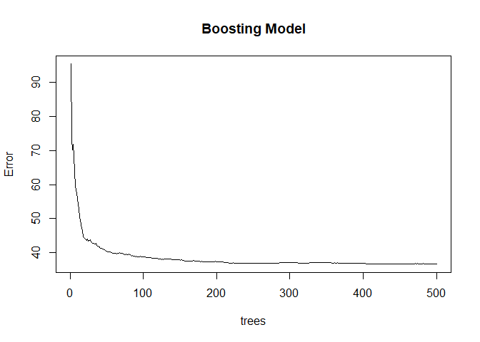

\#ECO 395M: Exercise 3

Bernardo Arreal Magalhaes - UTEID ba25727

Adhish Luitel - UTEID al49674

Ji Heon Shim - UTEID js93996

Exercise 3.1
------------

In this exercise, we analyzed a dataset on green buildings to build the
best predictive pricing model. We started with cleaning the data. First
we detected all the null values that were missing and deleted them. As
we are running a lasso regression, in order to comply with the limits of
computation, we also lowered the scale of the variable ‘size’.

Next, we built a base model and used step-wise selection. From the
insights we gathered while cleaning up the data, we decided to delete
the variable ‘CS\_PropertyID’ as it was just a unique identity number
and contributed nothing to our model. We also deleted another variable
‘total\_dd\_07’ due to the nature of its collinearity with the variables
‘cd\_total\_07’ and ‘hd\_total07’. The latter two variables add up to
become ‘total\_dd\_07’ so we decided to remove the dependant variable
out of the three. Lastly, we also deleted the variable ‘cluster’ from
our model as it was recognized as a numerical variable even though it
was a categorical variable.

Finally, in order to check if a building is a green building, we used
only ‘green\_rating’ as our dummy variable and didn’t consider ‘LEED’
and ‘EnergyStar’ separately.

To find the best predictive model possible for price, we built 5
different models and compared their performances. At the same time, we
measured elapsed time while we were running each model to see its
computational efficiency.

### Stepwise Selection Model

First, we used stepwise regression method to find the model with the
best performance. We built i) forward selection model, ii) backward
selection model and iii) stepwise selection model. i) Forward selection
model starts with a model having no variables, and add all possible
one-variable additions to it including every interaction. ii) Backward
selection model starts with the full model that has all the variables
including interactions in it, then improves its performance by deleting
each variable. iii) Stepwise selection model starts with our base model
‘lm(Rent~(.-CS\_PropertyID-LEED-Energystar-total\_dd\_07-cluster)’ and
we considered all possible one-variable addtions or deletions including
interactions.

Here’s our best predictive stepwise selection model with 84 variables
obtained by backward selection.

    model1

    ## 
    ## Call:
    ## lm(formula = Rent ~ size + empl_gr + leasing_rate + stories + 
    ##     age + renovated + class_a + class_b + green_rating + net + 
    ##     amenities + cd_total_07 + hd_total07 + Precipitation + Gas_Costs + 
    ##     Electricity_Costs + cluster_rent + size:leasing_rate + size:stories + 
    ##     size:age + size:renovated + size:class_a + size:class_b + 
    ##     size:cd_total_07 + size:hd_total07 + size:Electricity_Costs + 
    ##     size:cluster_rent + empl_gr:age + empl_gr:class_b + empl_gr:Gas_Costs + 
    ##     leasing_rate:cd_total_07 + leasing_rate:hd_total07 + leasing_rate:Precipitation + 
    ##     leasing_rate:Gas_Costs + leasing_rate:Electricity_Costs + 
    ##     leasing_rate:cluster_rent + stories:age + stories:renovated + 
    ##     stories:class_a + stories:class_b + stories:amenities + stories:cd_total_07 + 
    ##     stories:Precipitation + stories:Electricity_Costs + stories:cluster_rent + 
    ##     age:class_a + age:class_b + age:green_rating + age:cd_total_07 + 
    ##     age:hd_total07 + age:cluster_rent + renovated:cd_total_07 + 
    ##     renovated:hd_total07 + renovated:Precipitation + renovated:Gas_Costs + 
    ##     renovated:Electricity_Costs + renovated:cluster_rent + class_a:amenities + 
    ##     class_a:cd_total_07 + class_a:hd_total07 + class_a:Precipitation + 
    ##     class_a:Gas_Costs + class_a:Electricity_Costs + class_b:cd_total_07 + 
    ##     class_b:hd_total07 + class_b:Precipitation + class_b:Gas_Costs + 
    ##     class_b:Electricity_Costs + green_rating:amenities + net:cd_total_07 + 
    ##     net:cluster_rent + amenities:Precipitation + amenities:Gas_Costs + 
    ##     amenities:Electricity_Costs + amenities:cluster_rent + cd_total_07:Gas_Costs + 
    ##     cd_total_07:Electricity_Costs + hd_total07:Precipitation + 
    ##     hd_total07:Gas_Costs + hd_total07:Electricity_Costs + Precipitation:Gas_Costs + 
    ##     Precipitation:Electricity_Costs + Electricity_Costs:cluster_rent, 
    ##     data = grb)
    ## 
    ## Coefficients:
    ##                     (Intercept)                             size  
    ##                       2.300e+01                       -3.451e-03  
    ##                         empl_gr                     leasing_rate  
    ##                      -1.409e+00                       -1.121e-01  
    ##                         stories                              age  
    ##                      -2.524e-01                        1.239e-01  
    ##                       renovated                          class_a  
    ##                      -8.201e+00                        2.677e+01  
    ##                         class_b                     green_rating  
    ##                       2.391e+01                        1.276e+00  
    ##                             net                        amenities  
    ##                      -1.210e+00                       -3.703e+00  
    ##                     cd_total_07                       hd_total07  
    ##                      -1.059e-02                       -4.924e-03  
    ##                   Precipitation                        Gas_Costs  
    ##                       7.332e-01                       -2.335e+03  
    ##               Electricity_Costs                     cluster_rent  
    ##                      -3.054e+02                        6.379e-01  
    ##               size:leasing_rate                     size:stories  
    ##                       8.265e-05                       -4.232e-05  
    ##                        size:age                   size:renovated  
    ##                      -1.410e-04                        7.104e-03  
    ##                    size:class_a                     size:class_b  
    ##                      -2.102e-02                       -1.657e-02  
    ##                size:cd_total_07                  size:hd_total07  
    ##                      -4.260e-06                        7.412e-07  
    ##          size:Electricity_Costs                size:cluster_rent  
    ##                       4.962e-01                        5.182e-04  
    ##                     empl_gr:age                  empl_gr:class_b  
    ##                       1.171e-03                       -8.590e-02  
    ##               empl_gr:Gas_Costs         leasing_rate:cd_total_07  
    ##                       1.287e+02                        1.569e-05  
    ##         leasing_rate:hd_total07       leasing_rate:Precipitation  
    ##                       8.867e-06                        1.947e-03  
    ##          leasing_rate:Gas_Costs   leasing_rate:Electricity_Costs  
    ##                      -1.073e+01                        2.846e+00  
    ##       leasing_rate:cluster_rent                      stories:age  
    ##                       1.609e-03                        3.871e-03  
    ##               stories:renovated                  stories:class_a  
    ##                      -2.148e-01                        4.110e-01  
    ##                 stories:class_b                stories:amenities  
    ##                       3.798e-01                        9.247e-02  
    ##             stories:cd_total_07            stories:Precipitation  
    ##                       6.973e-05                       -2.530e-03  
    ##       stories:Electricity_Costs             stories:cluster_rent  
    ##                      -5.517e+00                       -4.516e-03  
    ##                     age:class_a                      age:class_b  
    ##                      -3.931e-02                       -4.925e-02  
    ##                age:green_rating                  age:cd_total_07  
    ##                       4.046e-02                       -1.796e-05  
    ##                  age:hd_total07                 age:cluster_rent  
    ##                      -8.790e-06                       -2.820e-03  
    ##           renovated:cd_total_07             renovated:hd_total07  
    ##                       1.011e-03                        8.541e-04  
    ##         renovated:Precipitation              renovated:Gas_Costs  
    ##                       8.598e-02                       -4.343e+02  
    ##     renovated:Electricity_Costs           renovated:cluster_rent  
    ##                       1.837e+02                        6.662e-02  
    ##               class_a:amenities              class_a:cd_total_07  
    ##                      -1.017e+00                       -2.033e-03  
    ##              class_a:hd_total07            class_a:Precipitation  
    ##                      -1.985e-03                       -2.806e-01  
    ##               class_a:Gas_Costs        class_a:Electricity_Costs  
    ##                       1.412e+03                       -6.459e+02  
    ##             class_b:cd_total_07               class_b:hd_total07  
    ##                      -1.473e-03                       -1.492e-03  
    ##           class_b:Precipitation                class_b:Gas_Costs  
    ##                      -2.675e-01                        9.906e+02  
    ##       class_b:Electricity_Costs           green_rating:amenities  
    ##                      -5.397e+02                       -2.097e+00  
    ##                 net:cd_total_07                 net:cluster_rent  
    ##                       8.602e-04                       -8.390e-02  
    ##         amenities:Precipitation              amenities:Gas_Costs  
    ##                      -7.377e-02                        3.762e+02  
    ##     amenities:Electricity_Costs           amenities:cluster_rent  
    ##                       1.090e+02                       -6.376e-02  
    ##           cd_total_07:Gas_Costs    cd_total_07:Electricity_Costs  
    ##                       5.309e-01                        1.524e-01  
    ##        hd_total07:Precipitation             hd_total07:Gas_Costs  
    ##                      -4.818e-05                        3.742e-01  
    ##    hd_total07:Electricity_Costs          Precipitation:Gas_Costs  
    ##                       1.150e-01                       -2.305e+01  
    ## Precipitation:Electricity_Costs   Electricity_Costs:cluster_rent  
    ##                      -5.407e+00                        7.812e+00

The table below shows performance measured by AIC, elapsed time and
variables of each model. As we can see, the backward selection model
gave us our minimum AIC of 34372.28 with 84 variables, although it took
the longest time for computation. We did an additional stepwise
selection based on this model to check if we could get improvements, but
we didn’t witness a further minimized AIC. So we concluded that the
backward selection model is out best model when we used stepwise
selection.

<table class="table table-striped" style="margin-left: auto; margin-right: auto;">
<thead>
<tr>
<th style="text-align:left;">
v
</th>
<th style="text-align:left;">
Forward\_selection
</th>
<th style="text-align:left;">
Backward\_selection
</th>
<th style="text-align:left;">
Stepwise\_selection
</th>
</tr>
</thead>
<tbody>
<tr>
<td style="text-align:left;">
AIC
</td>
<td style="text-align:left;">
34512.51
</td>
<td style="text-align:left;">
34372.28
</td>
<td style="text-align:left;">
34407.55
</td>
</tr>
<tr>
<td style="text-align:left;">
Variables
</td>
<td style="text-align:left;">
50
</td>
<td style="text-align:left;">
84
</td>
<td style="text-align:left;">
68
</td>
</tr>
<tr>
<td style="text-align:left;">
Elapsed Time
</td>
<td style="text-align:left;">
36sec
</td>
<td style="text-align:left;">
13min 58sec
</td>
<td style="text-align:left;">
3min 5sec
</td>
</tr>
</tbody>
</table>

    ## Start:  AIC=34372.28
    ## Rent ~ size + empl_gr + leasing_rate + stories + age + renovated + 
    ##     class_a + class_b + green_rating + net + amenities + cd_total_07 + 
    ##     hd_total07 + Precipitation + Gas_Costs + Electricity_Costs + 
    ##     cluster_rent + size:leasing_rate + size:stories + size:age + 
    ##     size:renovated + size:class_a + size:class_b + size:cd_total_07 + 
    ##     size:hd_total07 + size:Electricity_Costs + size:cluster_rent + 
    ##     empl_gr:age + empl_gr:class_b + empl_gr:Gas_Costs + leasing_rate:cd_total_07 + 
    ##     leasing_rate:hd_total07 + leasing_rate:Precipitation + leasing_rate:Gas_Costs + 
    ##     leasing_rate:Electricity_Costs + leasing_rate:cluster_rent + 
    ##     stories:age + stories:renovated + stories:class_a + stories:class_b + 
    ##     stories:amenities + stories:cd_total_07 + stories:Precipitation + 
    ##     stories:Electricity_Costs + stories:cluster_rent + age:class_a + 
    ##     age:class_b + age:green_rating + age:cd_total_07 + age:hd_total07 + 
    ##     age:cluster_rent + renovated:cd_total_07 + renovated:hd_total07 + 
    ##     renovated:Precipitation + renovated:Gas_Costs + renovated:Electricity_Costs + 
    ##     renovated:cluster_rent + class_a:amenities + class_a:cd_total_07 + 
    ##     class_a:hd_total07 + class_a:Precipitation + class_a:Gas_Costs + 
    ##     class_a:Electricity_Costs + class_b:cd_total_07 + class_b:hd_total07 + 
    ##     class_b:Precipitation + class_b:Gas_Costs + class_b:Electricity_Costs + 
    ##     green_rating:amenities + net:cd_total_07 + net:cluster_rent + 
    ##     amenities:Precipitation + amenities:Gas_Costs + amenities:Electricity_Costs + 
    ##     amenities:cluster_rent + cd_total_07:Gas_Costs + cd_total_07:Electricity_Costs + 
    ##     hd_total07:Precipitation + hd_total07:Gas_Costs + hd_total07:Electricity_Costs + 
    ##     Precipitation:Gas_Costs + Precipitation:Electricity_Costs + 
    ##     Electricity_Costs:cluster_rent
    ## 
    ##                                   Df Sum of Sq    RSS   AIC
    ## <none>                                         620567 34372
    ## + age:renovated                    1     141.9 620425 34372
    ## - empl_gr:age                      1     175.7 620743 34372
    ## - Precipitation:Gas_Costs          1     176.5 620744 34373
    ## + cd_total_07:hd_total07           1     140.8 620426 34373
    ## - net:cluster_rent                 1     184.9 620752 34373
    ## + amenities:hd_total07             1     119.1 620448 34373
    ## + empl_gr:leasing_rate             1     117.7 620449 34373
    ## - Precipitation:Electricity_Costs  1     202.1 620769 34373
    ## + leasing_rate:renovated           1     111.2 620456 34373
    ## + cd_total_07:Precipitation        1      88.6 620479 34373
    ## + size:Precipitation               1      80.3 620487 34373
    ## - age:green_rating                 1     251.4 620819 34373
    ## - class_a:amenities                1     254.1 620821 34373
    ## + renovated:net                    1      62.4 620505 34373
    ## + net:hd_total07                   1      57.5 620510 34374
    ## + green_rating:net                 1      53.6 620514 34374
    ## + class_a:net                      1      47.8 620519 34374
    ## + green_rating:Precipitation       1      47.0 620520 34374
    ## + class_a:cluster_rent             1      44.9 620522 34374
    ## + Gas_Costs:Electricity_Costs      1      44.7 620522 34374
    ## + empl_gr:net                      1      44.4 620523 34374
    ## + green_rating:cluster_rent        1      42.1 620525 34374
    ## + stories:Gas_Costs                1      41.7 620525 34374
    ## + leasing_rate:age                 1      40.6 620527 34374
    ## + size:Gas_Costs                   1      38.5 620529 34374
    ## + age:Electricity_Costs            1      37.1 620530 34374
    ## + empl_gr:renovated                1      36.8 620530 34374
    ## + age:amenities                    1      35.4 620532 34374
    ## + leasing_rate:stories             1      33.4 620534 34374
    ## + class_b:amenities                1      33.3 620534 34374
    ## + stories:net                      1      29.9 620537 34374
    ## + empl_gr:stories                  1      28.0 620539 34374
    ## + renovated:class_a                1      27.2 620540 34374
    ## + empl_gr:Electricity_Costs        1      26.5 620541 34374
    ## - leasing_rate:hd_total07          1     291.2 620858 34374
    ## + cd_total_07:cluster_rent         1      24.4 620543 34374
    ## + net:Precipitation                1      20.7 620546 34374
    ## + empl_gr:cluster_rent             1      20.4 620547 34374
    ## + size:net                         1      19.5 620548 34374
    ## + green_rating:cd_total_07         1      18.0 620549 34374
    ## - size:stories                     1     299.8 620867 34374
    ## + green_rating:hd_total07          1      17.1 620550 34374
    ## + class_b:cluster_rent             1      14.9 620552 34374
    ## + empl_gr:hd_total07               1      14.0 620553 34374
    ## + age:Precipitation                1      13.7 620553 34374
    ## + renovated:green_rating           1      13.3 620554 34374
    ## + hd_total07:cluster_rent          1      12.6 620555 34374
    ## + net:Gas_Costs                    1      12.5 620555 34374
    ## - net:cd_total_07                  1     305.2 620872 34374
    ## + class_b:green_rating             1      11.8 620555 34374
    ## + leasing_rate:net                 1      11.0 620556 34374
    ## + empl_gr:class_a                  1      10.5 620557 34374
    ## + size:amenities                   1       9.0 620558 34374
    ## + net:amenities                    1       8.4 620559 34374
    ## + size:green_rating                1       7.1 620560 34374
    ## + age:Gas_Costs                    1       7.0 620560 34374
    ## + leasing_rate:class_a             1       6.2 620561 34374
    ## + age:net                          1       5.4 620562 34374
    ## + class_b:net                      1       5.0 620562 34374
    ## + size:empl_gr                     1       4.8 620562 34374
    ## + green_rating:Gas_Costs           1       3.8 620563 34374
    ## + green_rating:Electricity_Costs   1       2.9 620564 34374
    ## + leasing_rate:green_rating        1       2.4 620565 34374
    ## + renovated:class_b                1       2.1 620565 34374
    ## + empl_gr:green_rating             1       2.0 620565 34374
    ## + leasing_rate:amenities           1       1.6 620565 34374
    ## + Precipitation:cluster_rent       1       1.4 620566 34374
    ## + leasing_rate:class_b             1       1.1 620566 34374
    ## + empl_gr:cd_total_07              1       1.1 620566 34374
    ## + stories:green_rating             1       1.0 620566 34374
    ## + class_a:green_rating             1       0.4 620567 34374
    ## + amenities:cd_total_07            1       0.3 620567 34374
    ## + renovated:amenities              1       0.2 620567 34374
    ## + empl_gr:Precipitation            1       0.2 620567 34374
    ## + empl_gr:amenities                1       0.0 620567 34374
    ## + net:Electricity_Costs            1       0.0 620567 34374
    ## + stories:hd_total07               1       0.0 620567 34374
    ## + Gas_Costs:cluster_rent           1       0.0 620567 34374
    ## - size:hd_total07                  1     317.7 620885 34374
    ## - stories:Electricity_Costs        1     337.6 620905 34375
    ## - amenities:cluster_rent           1     376.2 620943 34375
    ## - renovated:cluster_rent           1     376.6 620944 34375
    ## - amenities:Gas_Costs              1     380.5 620948 34375
    ## - hd_total07:Gas_Costs             1     389.9 620957 34375
    ## - leasing_rate:Electricity_Costs   1     396.3 620963 34375
    ## - stories:cluster_rent             1     396.8 620964 34375
    ## - stories:Precipitation            1     398.8 620966 34375
    ## - amenities:Precipitation          1     413.0 620980 34375
    ## - age:class_a                      1     444.3 621011 34376
    ## - cd_total_07:Gas_Costs            1     447.3 621014 34376
    ## - leasing_rate:cd_total_07         1     453.8 621021 34376
    ## - renovated:Gas_Costs              1     476.6 621044 34376
    ## - green_rating:amenities           1     503.3 621070 34377
    ## - leasing_rate:cluster_rent        1     506.0 621073 34377
    ## - empl_gr:class_b                  1     536.3 621103 34377
    ## - leasing_rate:Gas_Costs           1     539.7 621107 34377
    ## - renovated:Precipitation          1     542.8 621110 34377
    ## - size:leasing_rate                1     559.2 621126 34377
    ## - amenities:Electricity_Costs      1     568.6 621136 34377
    ## - leasing_rate:Precipitation       1     572.4 621140 34377
    ## - empl_gr:Gas_Costs                1     575.6 621143 34378
    ## - hd_total07:Precipitation         1     689.4 621257 34379
    ## - renovated:cd_total_07            1     767.9 621335 34380
    ## - class_b:cd_total_07              1     797.4 621365 34380
    ## - age:cd_total_07                  1     805.2 621372 34380
    ## - age:hd_total07                   1     821.9 621389 34381
    ## - size:Electricity_Costs           1     855.7 621423 34381
    ## - renovated:Electricity_Costs      1     868.1 621435 34381
    ## - class_b:Gas_Costs                1     883.4 621451 34381
    ## - stories:cd_total_07              1     949.9 621517 34382
    ## - size:class_b                     1     977.3 621544 34383
    ## - stories:amenities                1    1036.3 621603 34383
    ## - Electricity_Costs:cluster_rent   1    1170.2 621737 34385
    ## - class_a:cd_total_07              1    1173.1 621740 34385
    ## - age:class_b                      1    1332.5 621900 34387
    ## - size:class_a                     1    1428.5 621996 34388
    ## - renovated:hd_total07             1    1484.2 622051 34389
    ## - size:cd_total_07                 1    1586.2 622153 34390
    ## - size:age                         1    1617.5 622185 34391
    ## - stories:class_a                  1    1691.7 622259 34392
    ## - stories:class_b                  1    1724.3 622291 34392
    ## - hd_total07:Electricity_Costs     1    1724.3 622291 34392
    ## - class_a:Gas_Costs                1    1778.4 622346 34393
    ## - class_b:hd_total07               1    1930.7 622498 34395
    ## - cd_total_07:Electricity_Costs    1    1967.9 622535 34395
    ## - stories:age                      1    2004.0 622571 34395
    ## - size:renovated                   1    2039.1 622606 34396
    ## - class_a:Precipitation            1    2141.5 622709 34397
    ## - class_b:Precipitation            1    2347.9 622915 34400
    ## - class_a:hd_total07               1    2522.6 623090 34402
    ## - age:cluster_rent                 1    2860.6 623428 34406
    ## - stories:renovated                1    2865.4 623433 34406
    ## - size:cluster_rent                1    3013.4 623581 34408
    ## - class_b:Electricity_Costs        1    4446.6 625014 34426
    ## - class_a:Electricity_Costs        1    5102.1 625669 34434

    ## 
    ## Call:
    ## lm(formula = Rent ~ size + empl_gr + leasing_rate + stories + 
    ##     age + renovated + class_a + class_b + green_rating + net + 
    ##     amenities + cd_total_07 + hd_total07 + Precipitation + Gas_Costs + 
    ##     Electricity_Costs + cluster_rent + size:leasing_rate + size:stories + 
    ##     size:age + size:renovated + size:class_a + size:class_b + 
    ##     size:cd_total_07 + size:hd_total07 + size:Electricity_Costs + 
    ##     size:cluster_rent + empl_gr:age + empl_gr:class_b + empl_gr:Gas_Costs + 
    ##     leasing_rate:cd_total_07 + leasing_rate:hd_total07 + leasing_rate:Precipitation + 
    ##     leasing_rate:Gas_Costs + leasing_rate:Electricity_Costs + 
    ##     leasing_rate:cluster_rent + stories:age + stories:renovated + 
    ##     stories:class_a + stories:class_b + stories:amenities + stories:cd_total_07 + 
    ##     stories:Precipitation + stories:Electricity_Costs + stories:cluster_rent + 
    ##     age:class_a + age:class_b + age:green_rating + age:cd_total_07 + 
    ##     age:hd_total07 + age:cluster_rent + renovated:cd_total_07 + 
    ##     renovated:hd_total07 + renovated:Precipitation + renovated:Gas_Costs + 
    ##     renovated:Electricity_Costs + renovated:cluster_rent + class_a:amenities + 
    ##     class_a:cd_total_07 + class_a:hd_total07 + class_a:Precipitation + 
    ##     class_a:Gas_Costs + class_a:Electricity_Costs + class_b:cd_total_07 + 
    ##     class_b:hd_total07 + class_b:Precipitation + class_b:Gas_Costs + 
    ##     class_b:Electricity_Costs + green_rating:amenities + net:cd_total_07 + 
    ##     net:cluster_rent + amenities:Precipitation + amenities:Gas_Costs + 
    ##     amenities:Electricity_Costs + amenities:cluster_rent + cd_total_07:Gas_Costs + 
    ##     cd_total_07:Electricity_Costs + hd_total07:Precipitation + 
    ##     hd_total07:Gas_Costs + hd_total07:Electricity_Costs + Precipitation:Gas_Costs + 
    ##     Precipitation:Electricity_Costs + Electricity_Costs:cluster_rent, 
    ##     data = grb)
    ## 
    ## Coefficients:
    ##                     (Intercept)                             size  
    ##                       2.300e+01                       -3.451e-03  
    ##                         empl_gr                     leasing_rate  
    ##                      -1.409e+00                       -1.121e-01  
    ##                         stories                              age  
    ##                      -2.524e-01                        1.239e-01  
    ##                       renovated                          class_a  
    ##                      -8.201e+00                        2.677e+01  
    ##                         class_b                     green_rating  
    ##                       2.391e+01                        1.276e+00  
    ##                             net                        amenities  
    ##                      -1.210e+00                       -3.703e+00  
    ##                     cd_total_07                       hd_total07  
    ##                      -1.059e-02                       -4.924e-03  
    ##                   Precipitation                        Gas_Costs  
    ##                       7.332e-01                       -2.335e+03  
    ##               Electricity_Costs                     cluster_rent  
    ##                      -3.054e+02                        6.379e-01  
    ##               size:leasing_rate                     size:stories  
    ##                       8.265e-05                       -4.232e-05  
    ##                        size:age                   size:renovated  
    ##                      -1.410e-04                        7.104e-03  
    ##                    size:class_a                     size:class_b  
    ##                      -2.102e-02                       -1.657e-02  
    ##                size:cd_total_07                  size:hd_total07  
    ##                      -4.260e-06                        7.412e-07  
    ##          size:Electricity_Costs                size:cluster_rent  
    ##                       4.962e-01                        5.182e-04  
    ##                     empl_gr:age                  empl_gr:class_b  
    ##                       1.171e-03                       -8.590e-02  
    ##               empl_gr:Gas_Costs         leasing_rate:cd_total_07  
    ##                       1.287e+02                        1.569e-05  
    ##         leasing_rate:hd_total07       leasing_rate:Precipitation  
    ##                       8.867e-06                        1.947e-03  
    ##          leasing_rate:Gas_Costs   leasing_rate:Electricity_Costs  
    ##                      -1.073e+01                        2.846e+00  
    ##       leasing_rate:cluster_rent                      stories:age  
    ##                       1.609e-03                        3.871e-03  
    ##               stories:renovated                  stories:class_a  
    ##                      -2.148e-01                        4.110e-01  
    ##                 stories:class_b                stories:amenities  
    ##                       3.798e-01                        9.247e-02  
    ##             stories:cd_total_07            stories:Precipitation  
    ##                       6.973e-05                       -2.530e-03  
    ##       stories:Electricity_Costs             stories:cluster_rent  
    ##                      -5.517e+00                       -4.516e-03  
    ##                     age:class_a                      age:class_b  
    ##                      -3.931e-02                       -4.925e-02  
    ##                age:green_rating                  age:cd_total_07  
    ##                       4.046e-02                       -1.796e-05  
    ##                  age:hd_total07                 age:cluster_rent  
    ##                      -8.790e-06                       -2.820e-03  
    ##           renovated:cd_total_07             renovated:hd_total07  
    ##                       1.011e-03                        8.541e-04  
    ##         renovated:Precipitation              renovated:Gas_Costs  
    ##                       8.598e-02                       -4.343e+02  
    ##     renovated:Electricity_Costs           renovated:cluster_rent  
    ##                       1.837e+02                        6.662e-02  
    ##               class_a:amenities              class_a:cd_total_07  
    ##                      -1.017e+00                       -2.033e-03  
    ##              class_a:hd_total07            class_a:Precipitation  
    ##                      -1.985e-03                       -2.806e-01  
    ##               class_a:Gas_Costs        class_a:Electricity_Costs  
    ##                       1.412e+03                       -6.459e+02  
    ##             class_b:cd_total_07               class_b:hd_total07  
    ##                      -1.473e-03                       -1.492e-03  
    ##           class_b:Precipitation                class_b:Gas_Costs  
    ##                      -2.675e-01                        9.906e+02  
    ##       class_b:Electricity_Costs           green_rating:amenities  
    ##                      -5.397e+02                       -2.097e+00  
    ##                 net:cd_total_07                 net:cluster_rent  
    ##                       8.602e-04                       -8.390e-02  
    ##         amenities:Precipitation              amenities:Gas_Costs  
    ##                      -7.377e-02                        3.762e+02  
    ##     amenities:Electricity_Costs           amenities:cluster_rent  
    ##                       1.090e+02                       -6.376e-02  
    ##           cd_total_07:Gas_Costs    cd_total_07:Electricity_Costs  
    ##                       5.309e-01                        1.524e-01  
    ##        hd_total07:Precipitation             hd_total07:Gas_Costs  
    ##                      -4.818e-05                        3.742e-01  
    ##    hd_total07:Electricity_Costs          Precipitation:Gas_Costs  
    ##                       1.150e-01                       -2.305e+01  
    ## Precipitation:Electricity_Costs   Electricity_Costs:cluster_rent  
    ##                      -5.407e+00                        7.812e+00

Finally, we did K-fold cross validation to check RMSE when K is 10. When
we calculate RMSE for the backward selection model, it turned out to be
9.1.

    ## [1] 9.097035

### Lasso Regression Model

After this, we fit a lasso regression model to attempt to assemble the
best predictive model. We used our full model including all the
variables and interactions except some features(CS\_PropertyID, LEED,
Energystar, total\_dd\_07, cluster) like we did in the stepwise
selection. Running the lasso regression model, the path plot appeared to
be the diagram below.

When we measured AICcs of all the segments, the 100th segment has the
lowest AIC value of 34644.64.

    min(AICc(grblasso))

    ## [1] 34644.64

    which.min(AICc(grblasso))

    ## seg100 
    ##    100

Our optimal value of lambda turned out to be -2.17 in log scale, and at
the optimal lambda, our lasso regression model has 25 variables and
intercept.Here are the coefficients of our optimal lasso regression
model.

    ## 154 x 1 sparse Matrix of class "dgCMatrix"
    ##                                        seg100
    ## intercept                        2.578000e+00
    ## size                             .           
    ## empl_gr                          .           
    ## leasing_rate                     .           
    ## stories                          .           
    ## age                              .           
    ## renovated                        .           
    ## class_a                          .           
    ## class_b                          .           
    ## green_rating                     .           
    ## net                              .           
    ## amenities                        .           
    ## cd_total_07                      .           
    ## hd_total07                       .           
    ## Precipitation                    .           
    ## Gas_Costs                        .           
    ## Electricity_Costs                .           
    ## cluster_rent                     7.225084e-01
    ## size:empl_gr                     .           
    ## size:leasing_rate                .           
    ## size:stories                    -2.075314e-05
    ## size:age                        -1.585017e-05
    ## size:renovated                   .           
    ## size:class_a                     .           
    ## size:class_b                     .           
    ## size:green_rating                .           
    ## size:net                         .           
    ## size:amenities                   .           
    ## size:cd_total_07                -1.517679e-06
    ## size:hd_total07                 -1.205905e-07
    ## size:Precipitation              -3.081512e-05
    ## size:Gas_Costs                   .           
    ## size:Electricity_Costs           .           
    ## size:cluster_rent                4.312108e-04
    ## empl_gr:leasing_rate             .           
    ## empl_gr:stories                  .           
    ## empl_gr:age                      .           
    ## empl_gr:renovated                .           
    ## empl_gr:class_a                  5.224541e-02
    ## empl_gr:class_b                  .           
    ## empl_gr:green_rating             .           
    ## empl_gr:net                      .           
    ## empl_gr:amenities                .           
    ## empl_gr:cd_total_07              .           
    ## empl_gr:hd_total07               .           
    ## empl_gr:Precipitation            .           
    ## empl_gr:Gas_Costs                .           
    ## empl_gr:Electricity_Costs        .           
    ## empl_gr:cluster_rent             .           
    ## leasing_rate:stories             .           
    ## leasing_rate:age                -5.843784e-05
    ## leasing_rate:renovated           .           
    ## leasing_rate:class_a             .           
    ## leasing_rate:class_b             .           
    ## leasing_rate:green_rating        .           
    ## leasing_rate:net                 .           
    ## leasing_rate:amenities           .           
    ## leasing_rate:cd_total_07         .           
    ## leasing_rate:hd_total07          .           
    ## leasing_rate:Precipitation       .           
    ## leasing_rate:Gas_Costs           .           
    ## leasing_rate:Electricity_Costs   .           
    ## leasing_rate:cluster_rent        6.947976e-04
    ## stories:age                      .           
    ## stories:renovated               -8.078208e-03
    ## stories:class_a                  .           
    ## stories:class_b                  1.550392e-02
    ## stories:green_rating             .           
    ## stories:net                      .           
    ## stories:amenities                .           
    ## stories:cd_total_07              .           
    ## stories:hd_total07               .           
    ## stories:Precipitation           -2.635501e-04
    ## stories:Gas_Costs               -1.875013e-01
    ## stories:Electricity_Costs        .           
    ## stories:cluster_rent             .           
    ## age:renovated                    .           
    ## age:class_a                      .           
    ## age:class_b                      .           
    ## age:green_rating                 1.015769e-02
    ## age:net                          .           
    ## age:amenities                    .           
    ## age:cd_total_07                 -5.016511e-06
    ## age:hd_total07                   .           
    ## age:Precipitation                .           
    ## age:Gas_Costs                   -4.513846e-01
    ## age:Electricity_Costs            .           
    ## age:cluster_rent                 .           
    ## renovated:class_a                .           
    ## renovated:class_b                .           
    ## renovated:green_rating           .           
    ## renovated:net                    .           
    ## renovated:amenities              .           
    ## renovated:cd_total_07            .           
    ## renovated:hd_total07             .           
    ## renovated:Precipitation          .           
    ## renovated:Gas_Costs              .           
    ## renovated:Electricity_Costs      .           
    ## renovated:cluster_rent           .           
    ## class_a:class_b                  .           
    ## class_a:green_rating             .           
    ## class_a:net                      .           
    ## class_a:amenities                .           
    ## class_a:cd_total_07              .           
    ## class_a:hd_total07               .           
    ## class_a:Precipitation            .           
    ## class_a:Gas_Costs                .           
    ## class_a:Electricity_Costs        .           
    ## class_a:cluster_rent             4.119923e-02
    ## class_b:green_rating             1.790789e-01
    ## class_b:net                      .           
    ## class_b:amenities                1.839059e-01
    ## class_b:cd_total_07              .           
    ## class_b:hd_total07               .           
    ## class_b:Precipitation            .           
    ## class_b:Gas_Costs                .           
    ## class_b:Electricity_Costs        .           
    ## class_b:cluster_rent             .           
    ## green_rating:net                 .           
    ## green_rating:amenities           .           
    ## green_rating:cd_total_07         .           
    ## green_rating:hd_total07          .           
    ## green_rating:Precipitation       .           
    ## green_rating:Gas_Costs           .           
    ## green_rating:Electricity_Costs   .           
    ## green_rating:cluster_rent        7.906354e-03
    ## net:amenities                    .           
    ## net:cd_total_07                  .           
    ## net:hd_total07                   .           
    ## net:Precipitation                .           
    ## net:Gas_Costs                    .           
    ## net:Electricity_Costs            .           
    ## net:cluster_rent                -5.460240e-02
    ## amenities:cd_total_07            .           
    ## amenities:hd_total07             .           
    ## amenities:Precipitation          .           
    ## amenities:Gas_Costs              .           
    ## amenities:Electricity_Costs      1.568256e+01
    ## amenities:cluster_rent           .           
    ## cd_total_07:hd_total07           .           
    ## cd_total_07:Precipitation        .           
    ## cd_total_07:Gas_Costs            .           
    ## cd_total_07:Electricity_Costs    .           
    ## cd_total_07:cluster_rent         .           
    ## hd_total07:Precipitation         .           
    ## hd_total07:Gas_Costs             .           
    ## hd_total07:Electricity_Costs     5.316644e-03
    ## hd_total07:cluster_rent          .           
    ## Precipitation:Gas_Costs          .           
    ## Precipitation:Electricity_Costs  .           
    ## Precipitation:cluster_rent       .           
    ## Gas_Costs:Electricity_Costs      .           
    ## Gas_Costs:cluster_rent           .           
    ## Electricity_Costs:cluster_rent   2.473365e+00

    ##    seg100 
    ## -2.165552

    ## [1] 26

Then we followed identical steps for our lasso regression model as well.
We built a train-test split and repeated the step from 1 to K
repetitions by running a loop. We found that the root mean squared error
for our lasso model is 9.17, which was a lot higher than for out
stepwise selection model, so we can say that stepwise selection model
shows better performance than the lasso regression model. However, the
lasso model takes 0 seconds to compute all the procedures to derive its
optimal model whereas the stepwise method takes several minutes to do
the same thing. Therefore, we can say the lasso model is computationally
more efficient than the stepwise selection model.

    ## [1] 9.16501

### Tree - Bagging Model

To further polish our best prediction model, we tried treebagging our
best model with K-fold validation to assess the performance for each
model. We repeated similiar steps we previously did for our stepwise
selection and lasso models and ran a loop from 1 to K. We used our
base\_line
model(‘Rent~(.-CS\_PropertyID-LEED-Energystar-total\_dd\_07-cluster’)
for our tree bagging, and excluded all the interaction variables because
we didn’t need them explicity in tree regressions. We set the number of
trees 300 times and run the regression and it took more than 7 minutes
to compute the whole procedure. However, the RMSE for our bagging model
was 6.46 which is much lower than our those of our previous models.

    ## [1] 6.458856

Below, we constructed a plot that shows the error in the variables.
Judging by the relation between the error and the number of trees, 300
number of trees that we used in our model is enough to reduce our
errors.

In addition, we can see from our variable importance plot that
“cluster\_rent” variable has the most important impact on rent in our
tree bagging model followed by ‘size’ and ‘age’.

### Tree - Random Forest Model

Now, we fit a random forest model to predict rent price using our
base\_line model which we’ve seen in our tree bagging model. And we did
K-fold cross validation when K=10, which is same as before. Here is the
basic information of our random forest model. The whole computational
process took less than 3 minutes, and our RMSE is
`round(r sqrt(mean(err_save4)), 2)` which is the lowest of all models so
far.

    ## 
    ## Call:
    ##  randomForest(formula = Rent ~ (. - CS_PropertyID - LEED - Energystar -      total_dd_07 - cluster), data = grb[train_set4, ], ntree = 300) 
    ##                Type of random forest: regression
    ##                      Number of trees: 300
    ## No. of variables tried at each split: 5
    ## 
    ##           Mean of squared residuals: 37.15557
    ##                     % Var explained: 83.94

    ## [1] 6.216006

We can see two plots below. The first one shows that 300 trees with
which we ran the random forest is enough. The second one is the variable
importance plot. It shows a similar result in a sense that
‘cluster\_rent’ and ‘size’ variables are the two most influential
variables on our dependent variable, but it also shows a difference
because the third one is ‘Electricity costs’ unlike ‘age’ in bagging.

### Tree - Boosting

Finally, we fit a boosting model to derive the best predictive model. As
we’ve done before, we used our base\_line model.The result of our K-fold
cross validation shows that the RMSE is 8.26 which is slightly higher
than that of our random forest model. However, it took only 15 seconds
to compute all these procedures.

    ## [1] 8.263803

Here is the summary of our boosting model which shows the relative
influences of all variables. It appears to be ‘cluster\_rent’, ‘size’,
‘leasing\_rate’ are three most influential variables on our dependent
variable. This result is similar with previous results that we’ve seen
above, but the third influential variable is slightly different, too.

    ##                                 var     rel.inf
    ## cluster_rent           cluster_rent 66.01093973
    ## size                           size 16.81555222
    ## leasing_rate           leasing_rate  5.57688239
    ## age                             age  4.06863205
    ## stories                     stories  2.27611891
    ## Precipitation         Precipitation  1.85962815
    ## class_a                     class_a  1.28110173
    ## hd_total07               hd_total07  0.56207914
    ## Electricity_Costs Electricity_Costs  0.51702581
    ## cd_total_07             cd_total_07  0.49359058
    ## amenities                 amenities  0.14419911
    ## class_b                     class_b  0.11871632
    ## empl_gr                     empl_gr  0.11311416
    ## renovated                 renovated  0.07305686
    ## green_rating           green_rating  0.05378356
    ## Gas_Costs                 Gas_Costs  0.02521662
    ## net                             net  0.01036266

### Which model shows the best performance?

By using K-fold cross validation, we derived 5 RMSE out of 5 models as
below. We can see that the Randomforest Model shows the lowest RMSE
which means the best performance. Lasso and Boosting methods have
advantages of quick computation but their performance were worse than
our random forest model. Besides, Stepwise selection and Bagging methods
took more computational time than the random forest and their
performances didn’t outdo the random forest model. Therefore, we can
conclude that the random forest shows the best performance.

<table class="table table-striped" style="margin-left: auto; margin-right: auto;">
<tbody>
<tr>
<td style="text-align:left;">
Model
</td>
<td style="text-align:left;">
Stepwise
</td>
<td style="text-align:left;">
Lasso
</td>
<td style="text-align:left;">
Bagging
</td>
<td style="text-align:left;">
Randomforest
</td>
<td style="text-align:left;">
Boosting
</td>
</tr>
<tr>
<td style="text-align:left;">
RMSE
</td>
<td style="text-align:left;">
9.10
</td>
<td style="text-align:left;">
9.17
</td>
<td style="text-align:left;">
6.46
</td>
<td style="text-align:left;">
6.22
</td>
<td style="text-align:left;">
8.26
</td>
</tr>
</tbody>
</table>
