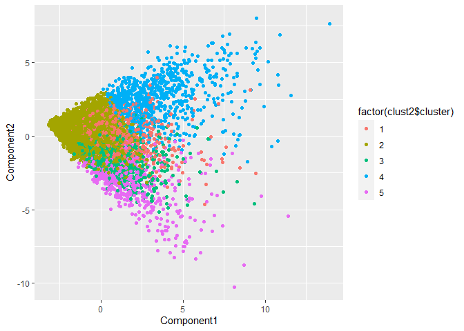

\#ECO 395M: Exercise 3

Bernardo Arreal Magalhaes - UTEID ba25727

Adhish Luitel - UTEID al49674

Ji Heon Shim - UTEID js93996

Exercise 3.1
------------

In this exercise, we analyzed a dataset on green buildings to build the
best predictive pricing model. We started with cleaning the data. First
we detected all the null values that were missing and deleted them. As
we are running a lasso regression, in order to comply with the limits of
computation, we scaled down ‘size’ variable from ‘square footage’ to
‘(square footage)/1000’.

Next, we built a base model and used step-wise selection. From the
insights we gathered while cleaning up the data, we decided to delete
the variable ‘CS\_PropertyID’ as it was just a unique identity number
and contributed nothing to our model. We also deleted another variable
‘total\_dd\_07’ due to the nature of its collinearity with the variables
‘cd\_total\_07’ and ‘hd\_total07’(total\_dd\_07 = cd\_total\_07 +
hd\_total07). Lastly, we also deleted the variable ‘cluster’ from our
model because it was recognized as a numerical variable though it was a
categorical one. And in order to reflect the effect of cluster on rent,
we already have cluster.rent variable which shows the average rent by
clusters.

Finally, in order to check if a building is a green building, we used
only ‘green\_rating’ as our dummy variable and didn’t consider ‘LEED’
and ‘EnergyStar’ separately.

To find the best predictive model possible for price, we built 5
different models and compared their performances. At the same time, we
measured elapsed time while we were running each model to see its
computational efficiency.

### Stepwise Selection Model

First, we used stepwise regression method to find the model with the
best performance. We built forward selection model, backward selection
model and stepwise selection model. i) Forward selection model starts
with a model having no variables, and add all possible one-variable
additions to it including every interaction. ii) Backward selection
model starts with the full model that has all the variables including
all of interactions, then improves its performance by deleting each
variable. iii) Stepwise selection model starts with our base model
‘lm(Rent~(.-CS\_PropertyID-LEED-Energystar-total\_dd\_07-cluster)’ and
we considered all possible one-variable addtions or deletions including
interactions.

The table below shows the performance measured by AIC, elapsed time and
the number of variables of each model. As we can see, the backward
selection model gives us the minimum AIC of 34372.28 with 84 variables,
but it took very long time to compute all these procedures. In terms of
AIC, we concluded that the backward selection model showed the best
performance among three and ran an additional stepwise selection based
on it to check if we could get any improvements. Since we didn’t witness
a further minimized AIC, we concluded that the backward selection model
is out best model when we used stepwise selection.

Here’s our best predictive stepwise selection model with 84 variables
obtained by backward selection.

    ## 
    ## Call:
    ## lm(formula = Rent ~ size + empl_gr + leasing_rate + stories + 
    ##     age + renovated + class_a + class_b + green_rating + net + 
    ##     amenities + cd_total_07 + hd_total07 + Precipitation + Gas_Costs + 
    ##     Electricity_Costs + cluster_rent + size:leasing_rate + size:stories + 
    ##     size:age + size:renovated + size:class_a + size:class_b + 
    ##     size:cd_total_07 + size:hd_total07 + size:Electricity_Costs + 
    ##     size:cluster_rent + empl_gr:age + empl_gr:class_b + empl_gr:Gas_Costs + 
    ##     leasing_rate:cd_total_07 + leasing_rate:hd_total07 + leasing_rate:Precipitation + 
    ##     leasing_rate:Gas_Costs + leasing_rate:Electricity_Costs + 
    ##     leasing_rate:cluster_rent + stories:age + stories:renovated + 
    ##     stories:class_a + stories:class_b + stories:amenities + stories:cd_total_07 + 
    ##     stories:Precipitation + stories:Electricity_Costs + stories:cluster_rent + 
    ##     age:class_a + age:class_b + age:green_rating + age:cd_total_07 + 
    ##     age:hd_total07 + age:cluster_rent + renovated:cd_total_07 + 
    ##     renovated:hd_total07 + renovated:Precipitation + renovated:Gas_Costs + 
    ##     renovated:Electricity_Costs + renovated:cluster_rent + class_a:amenities + 
    ##     class_a:cd_total_07 + class_a:hd_total07 + class_a:Precipitation + 
    ##     class_a:Gas_Costs + class_a:Electricity_Costs + class_b:cd_total_07 + 
    ##     class_b:hd_total07 + class_b:Precipitation + class_b:Gas_Costs + 
    ##     class_b:Electricity_Costs + green_rating:amenities + net:cd_total_07 + 
    ##     net:cluster_rent + amenities:Precipitation + amenities:Gas_Costs + 
    ##     amenities:Electricity_Costs + amenities:cluster_rent + cd_total_07:Gas_Costs + 
    ##     cd_total_07:Electricity_Costs + hd_total07:Precipitation + 
    ##     hd_total07:Gas_Costs + hd_total07:Electricity_Costs + Precipitation:Gas_Costs + 
    ##     Precipitation:Electricity_Costs + Electricity_Costs:cluster_rent, 
    ##     data = grb)
    ## 
    ## Coefficients:
    ##                     (Intercept)                             size  
    ##                       2.300e+01                       -3.451e-03  
    ##                         empl_gr                     leasing_rate  
    ##                      -1.409e+00                       -1.121e-01  
    ##                         stories                              age  
    ##                      -2.524e-01                        1.239e-01  
    ##                       renovated                          class_a  
    ##                      -8.201e+00                        2.677e+01  
    ##                         class_b                     green_rating  
    ##                       2.391e+01                        1.276e+00  
    ##                             net                        amenities  
    ##                      -1.210e+00                       -3.703e+00  
    ##                     cd_total_07                       hd_total07  
    ##                      -1.059e-02                       -4.924e-03  
    ##                   Precipitation                        Gas_Costs  
    ##                       7.332e-01                       -2.335e+03  
    ##               Electricity_Costs                     cluster_rent  
    ##                      -3.054e+02                        6.379e-01  
    ##               size:leasing_rate                     size:stories  
    ##                       8.265e-05                       -4.232e-05  
    ##                        size:age                   size:renovated  
    ##                      -1.410e-04                        7.104e-03  
    ##                    size:class_a                     size:class_b  
    ##                      -2.102e-02                       -1.657e-02  
    ##                size:cd_total_07                  size:hd_total07  
    ##                      -4.260e-06                        7.412e-07  
    ##          size:Electricity_Costs                size:cluster_rent  
    ##                       4.962e-01                        5.182e-04  
    ##                     empl_gr:age                  empl_gr:class_b  
    ##                       1.171e-03                       -8.590e-02  
    ##               empl_gr:Gas_Costs         leasing_rate:cd_total_07  
    ##                       1.287e+02                        1.569e-05  
    ##         leasing_rate:hd_total07       leasing_rate:Precipitation  
    ##                       8.867e-06                        1.947e-03  
    ##          leasing_rate:Gas_Costs   leasing_rate:Electricity_Costs  
    ##                      -1.073e+01                        2.846e+00  
    ##       leasing_rate:cluster_rent                      stories:age  
    ##                       1.609e-03                        3.871e-03  
    ##               stories:renovated                  stories:class_a  
    ##                      -2.148e-01                        4.110e-01  
    ##                 stories:class_b                stories:amenities  
    ##                       3.798e-01                        9.247e-02  
    ##             stories:cd_total_07            stories:Precipitation  
    ##                       6.973e-05                       -2.530e-03  
    ##       stories:Electricity_Costs             stories:cluster_rent  
    ##                      -5.517e+00                       -4.516e-03  
    ##                     age:class_a                      age:class_b  
    ##                      -3.931e-02                       -4.925e-02  
    ##                age:green_rating                  age:cd_total_07  
    ##                       4.046e-02                       -1.796e-05  
    ##                  age:hd_total07                 age:cluster_rent  
    ##                      -8.790e-06                       -2.820e-03  
    ##           renovated:cd_total_07             renovated:hd_total07  
    ##                       1.011e-03                        8.541e-04  
    ##         renovated:Precipitation              renovated:Gas_Costs  
    ##                       8.598e-02                       -4.343e+02  
    ##     renovated:Electricity_Costs           renovated:cluster_rent  
    ##                       1.837e+02                        6.662e-02  
    ##               class_a:amenities              class_a:cd_total_07  
    ##                      -1.017e+00                       -2.033e-03  
    ##              class_a:hd_total07            class_a:Precipitation  
    ##                      -1.985e-03                       -2.806e-01  
    ##               class_a:Gas_Costs        class_a:Electricity_Costs  
    ##                       1.412e+03                       -6.459e+02  
    ##             class_b:cd_total_07               class_b:hd_total07  
    ##                      -1.473e-03                       -1.492e-03  
    ##           class_b:Precipitation                class_b:Gas_Costs  
    ##                      -2.675e-01                        9.906e+02  
    ##       class_b:Electricity_Costs           green_rating:amenities  
    ##                      -5.397e+02                       -2.097e+00  
    ##                 net:cd_total_07                 net:cluster_rent  
    ##                       8.602e-04                       -8.390e-02  
    ##         amenities:Precipitation              amenities:Gas_Costs  
    ##                      -7.377e-02                        3.762e+02  
    ##     amenities:Electricity_Costs           amenities:cluster_rent  
    ##                       1.090e+02                       -6.376e-02  
    ##           cd_total_07:Gas_Costs    cd_total_07:Electricity_Costs  
    ##                       5.309e-01                        1.524e-01  
    ##        hd_total07:Precipitation             hd_total07:Gas_Costs  
    ##                      -4.818e-05                        3.742e-01  
    ##    hd_total07:Electricity_Costs          Precipitation:Gas_Costs  
    ##                       1.150e-01                       -2.305e+01  
    ## Precipitation:Electricity_Costs   Electricity_Costs:cluster_rent  
    ##                      -5.407e+00                        7.812e+00

Finally, we did K-fold cross validation to check RMSE when K is 10. We
built a train-test split and repeated the step from 1 to K repetitions
by running a loop. When we calculate RMSE for the backward selection
model, it turned out to be 9.07.

    #RMSE
    sqrt(mean(err_save))

    ## [1] 9.071444

### Lasso Regression Model

After this, we fit a lasso regression model to attempt to assemble the
best predictive model. We used our full model including all the
variables and interactions except some variable that we mentioned above
- CS\_PropertyID, LEED, Energystar, total\_dd\_07, cluster. Running the
lasso regression model, the path plot is shown on the diagram below.

When we measure AICcs of all the segments, the 100th segment has the
lowest AIC value of 34644.64.

    min(AICc(grblasso))

    ## [1] 34644.64

    which.min(AICc(grblasso))

    ## seg100 
    ##    100

Our optimal value of lambda turns out to be -2.17 in log scale, and at
the optimal lambda, our lasso regression model has 25 variables with an
intercept.The result below shows the coefficients of grb\_beta, the
minimum lambda in log scale, and the total number of variables including
an intercept.

    ## 154 x 1 sparse Matrix of class "dgCMatrix"
    ##                                        seg100
    ## intercept                        2.578000e+00
    ## size                             .           
    ## empl_gr                          .           
    ## leasing_rate                     .           
    ## stories                          .           
    ## age                              .           
    ## renovated                        .           
    ## class_a                          .           
    ## class_b                          .           
    ## green_rating                     .           
    ## net                              .           
    ## amenities                        .           
    ## cd_total_07                      .           
    ## hd_total07                       .           
    ## Precipitation                    .           
    ## Gas_Costs                        .           
    ## Electricity_Costs                .           
    ## cluster_rent                     7.225084e-01
    ## size:empl_gr                     .           
    ## size:leasing_rate                .           
    ## size:stories                    -2.075314e-05
    ## size:age                        -1.585017e-05
    ## size:renovated                   .           
    ## size:class_a                     .           
    ## size:class_b                     .           
    ## size:green_rating                .           
    ## size:net                         .           
    ## size:amenities                   .           
    ## size:cd_total_07                -1.517679e-06
    ## size:hd_total07                 -1.205905e-07
    ## size:Precipitation              -3.081512e-05
    ## size:Gas_Costs                   .           
    ## size:Electricity_Costs           .           
    ## size:cluster_rent                4.312108e-04
    ## empl_gr:leasing_rate             .           
    ## empl_gr:stories                  .           
    ## empl_gr:age                      .           
    ## empl_gr:renovated                .           
    ## empl_gr:class_a                  5.224541e-02
    ## empl_gr:class_b                  .           
    ## empl_gr:green_rating             .           
    ## empl_gr:net                      .           
    ## empl_gr:amenities                .           
    ## empl_gr:cd_total_07              .           
    ## empl_gr:hd_total07               .           
    ## empl_gr:Precipitation            .           
    ## empl_gr:Gas_Costs                .           
    ## empl_gr:Electricity_Costs        .           
    ## empl_gr:cluster_rent             .           
    ## leasing_rate:stories             .           
    ## leasing_rate:age                -5.843784e-05
    ## leasing_rate:renovated           .           
    ## leasing_rate:class_a             .           
    ## leasing_rate:class_b             .           
    ## leasing_rate:green_rating        .           
    ## leasing_rate:net                 .           
    ## leasing_rate:amenities           .           
    ## leasing_rate:cd_total_07         .           
    ## leasing_rate:hd_total07          .           
    ## leasing_rate:Precipitation       .           
    ## leasing_rate:Gas_Costs           .           
    ## leasing_rate:Electricity_Costs   .           
    ## leasing_rate:cluster_rent        6.947976e-04
    ## stories:age                      .           
    ## stories:renovated               -8.078208e-03
    ## stories:class_a                  .           
    ## stories:class_b                  1.550392e-02
    ## stories:green_rating             .           
    ## stories:net                      .           
    ## stories:amenities                .           
    ## stories:cd_total_07              .           
    ## stories:hd_total07               .           
    ## stories:Precipitation           -2.635501e-04
    ## stories:Gas_Costs               -1.875013e-01
    ## stories:Electricity_Costs        .           
    ## stories:cluster_rent             .           
    ## age:renovated                    .           
    ## age:class_a                      .           
    ## age:class_b                      .           
    ## age:green_rating                 1.015769e-02
    ## age:net                          .           
    ## age:amenities                    .           
    ## age:cd_total_07                 -5.016511e-06
    ## age:hd_total07                   .           
    ## age:Precipitation                .           
    ## age:Gas_Costs                   -4.513846e-01
    ## age:Electricity_Costs            .           
    ## age:cluster_rent                 .           
    ## renovated:class_a                .           
    ## renovated:class_b                .           
    ## renovated:green_rating           .           
    ## renovated:net                    .           
    ## renovated:amenities              .           
    ## renovated:cd_total_07            .           
    ## renovated:hd_total07             .           
    ## renovated:Precipitation          .           
    ## renovated:Gas_Costs              .           
    ## renovated:Electricity_Costs      .           
    ## renovated:cluster_rent           .           
    ## class_a:class_b                  .           
    ## class_a:green_rating             .           
    ## class_a:net                      .           
    ## class_a:amenities                .           
    ## class_a:cd_total_07              .           
    ## class_a:hd_total07               .           
    ## class_a:Precipitation            .           
    ## class_a:Gas_Costs                .           
    ## class_a:Electricity_Costs        .           
    ## class_a:cluster_rent             4.119923e-02
    ## class_b:green_rating             1.790789e-01
    ## class_b:net                      .           
    ## class_b:amenities                1.839059e-01
    ## class_b:cd_total_07              .           
    ## class_b:hd_total07               .           
    ## class_b:Precipitation            .           
    ## class_b:Gas_Costs                .           
    ## class_b:Electricity_Costs        .           
    ## class_b:cluster_rent             .           
    ## green_rating:net                 .           
    ## green_rating:amenities           .           
    ## green_rating:cd_total_07         .           
    ## green_rating:hd_total07          .           
    ## green_rating:Precipitation       .           
    ## green_rating:Gas_Costs           .           
    ## green_rating:Electricity_Costs   .           
    ## green_rating:cluster_rent        7.906354e-03
    ## net:amenities                    .           
    ## net:cd_total_07                  .           
    ## net:hd_total07                   .           
    ## net:Precipitation                .           
    ## net:Gas_Costs                    .           
    ## net:Electricity_Costs            .           
    ## net:cluster_rent                -5.460240e-02
    ## amenities:cd_total_07            .           
    ## amenities:hd_total07             .           
    ## amenities:Precipitation          .           
    ## amenities:Gas_Costs              .           
    ## amenities:Electricity_Costs      1.568256e+01
    ## amenities:cluster_rent           .           
    ## cd_total_07:hd_total07           .           
    ## cd_total_07:Precipitation        .           
    ## cd_total_07:Gas_Costs            .           
    ## cd_total_07:Electricity_Costs    .           
    ## cd_total_07:cluster_rent         .           
    ## hd_total07:Precipitation         .           
    ## hd_total07:Gas_Costs             .           
    ## hd_total07:Electricity_Costs     5.316644e-03
    ## hd_total07:cluster_rent          .           
    ## Precipitation:Gas_Costs          .           
    ## Precipitation:Electricity_Costs  .           
    ## Precipitation:cluster_rent       .           
    ## Gas_Costs:Electricity_Costs      .           
    ## Gas_Costs:cluster_rent           .           
    ## Electricity_Costs:cluster_rent   2.473365e+00

    ##    seg100 
    ## -2.165552

    ## [1] 26

Then we did K-fold cross validation on our lasso regression model as
well. We found that the root mean squared error for our lasso model is
9.17, which was a lot higher than for our stepwise selection model, so
we can say that the stepwise selection model shows better performance
than the lasso regression model. However, the lasso model takes almost 0
seconds to compute all the procedures to derive its best model whereas
the stepwise method takes more than 10 minutes to do the same thing.
Therefore, we can say the lasso model is computationally more efficient
than the stepwise selection model.

    #RMSE
    sqrt(mean(err_save2))

    ## [1] 9.167089

### Tree - Bagging Model

To further polish our best prediction model, we tried treebagging our
best model with K-fold validation to assess its performance. We used our
base
model(‘Rent~(.-CS\_PropertyID-LEED-Energystar-total\_dd\_07-cluster’)
for our tree bagging, and excluded all the interaction variables because
we didn’t need them explicity in tree regressions. The minimum size of
terminal nodes is 5 which is default setting. We set the number of trees
to be 300 times and run the regression. It took more than 7 minutes to
compute the whole procedure, however, the RMSE for our bagging model was
6.47 which was much lower than those of our previous models.

    #RMSE
    sqrt(mean(err_save3))

    ## [1] 6.468217

Below, we constructed a plot that shows the error in the variables.
Judging by the relation between the error and the number of trees, 300
trees which we used in our model is large enough to reduce our errors.

In addition, the graph below shows a variable importance plot. The
bigger the number is ,the greater the reduction on RMSE we get. We can
see that “cluster\_rent” variable has the most important impact on
decideing the rent price in our tree bagging model.

### Tree - Random Forest Model

Now, we fit a random forest model to predict rent price using our base
model and also did K-fold cross validation. First, we start with 300
trees and it took almost 3 minutes to compute all the procedures,
however, the plot below shows that the error curve stops decreasing much
after 50 trees. So we can reduce our number of trees to 100 and save our
computational time.

Now we fit a random forest model with 100 trees and do K-fold cross
validation again. The result indicates that the value of RMSE is 6.26
which is the smallest of all the RMSEs of the models we’ve seen above.
And the computational efficiency has been improved by taking less than 1
minute to compute all these procedures.

    ## 
    ## Call:
    ##  randomForest(formula = Rent ~ (. - CS_PropertyID - LEED - Energystar -      total_dd_07 - cluster), data = grb[train_set4, ], ntree = 100) 
    ##                Type of random forest: regression
    ##                      Number of trees: 100
    ## No. of variables tried at each split: 5
    ## 
    ##           Mean of squared residuals: 40.5741
    ##                     % Var explained: 82.51

    #RMSE
    sqrt(mean(err_save4))

    ## [1] 6.264436

The plot below is the variable importance plot. We can see that
‘cluster\_rent’ is the most important variable influencing rent price,
which is the same result as we saw in the bagging model. But it reveals
a slight difference in that the third influential variable is
‘Electricity costs’, which is ‘age’ in bagging.

### Tree - Boosting

Finally, we fit a boosting model to derive the best predictive model. As
we’ve done before, we use our base model to begin with. The result of
our K-fold cross validation shows that the RMSE is 8.28 which is
slightly higher than that of our random forest model. However, it took
only 15 seconds to compute all these procedures.

    #RMSE
    sqrt(mean(err_save5))

    ## [1] 8.280551

Here is the summary of our boosting model which shows the relative
influences of all variables. It appears to be ‘cluster\_rent’, ‘size’,
‘leasing\_rate’ are three most influential variables on our dependent
variable. This result is similar with previous results that we’ve seen
above, but the third influential variable is slightly different, too.

    summary(model5_train)

    ##                                 var      rel.inf
    ## cluster_rent           cluster_rent 65.511446995
    ## size                           size 16.973059316
    ## leasing_rate           leasing_rate  5.775356073
    ## age                             age  4.355874040
    ## stories                     stories  2.809054568
    ## Electricity_Costs Electricity_Costs  1.114105430
    ## class_a                     class_a  0.977814012
    ## Precipitation         Precipitation  0.879403764
    ## cd_total_07             cd_total_07  0.548325607
    ## hd_total07               hd_total07  0.322796411
    ## empl_gr                     empl_gr  0.217072885
    ## class_b                     class_b  0.198870952
    ## amenities                 amenities  0.162363744
    ## Gas_Costs                 Gas_Costs  0.066805687
    ## renovated                 renovated  0.059431465
    ## green_rating           green_rating  0.023280193
    ## net                             net  0.004938858

### Which model shows the best performance?

By using K-fold cross validation, we derived 5 RMSE out of 5 models as
below. We can see that the randomforest model shows the lowest RMSE
which means the best performance.

The randomforest model is superior in terms of computational speed. It
took less than 1 minute to compute all the procedures, which is very
efficient compared to the stepwise selection and the bagging. The lasso
regression and the boosting method didn’t take much computational time,
but their performances are worse than the random forest model.Therefore,
we can conclude that the random forest model shows the best performance.

<table class="table table-striped" style="margin-left: auto; margin-right: auto;">
<tbody>
<tr>
<td style="text-align:left;">
Model
</td>
<td style="text-align:left;">
Stepwise
</td>
<td style="text-align:left;">
Lasso
</td>
<td style="text-align:left;">
Bagging
</td>
<td style="text-align:left;">
Randomforest
</td>
<td style="text-align:left;">
Boosting
</td>
</tr>
<tr>
<td style="text-align:left;">
RMSE
</td>
<td style="text-align:left;">
9.07
</td>
<td style="text-align:left;">
9.17
</td>
<td style="text-align:left;">
6.47
</td>
<td style="text-align:left;">
6.26
</td>
<td style="text-align:left;">
8.28
</td>
</tr>
</tbody>
</table>

### The Partial Effect of Green Certification on Rent

In order to derive the average change in rental income per square foot
associated with green certification, holding other features of the
building constant, we used ‘partial’ function in ‘pdp package’.

The average rent value without green certification holding other
features constant is 28.50924, and the average rent value with green
certification holding other features is 29.07784. Therefore, the
difference 0.5686 is the average change in rental income per square foot
associated with green certification, holding other feature of the
building fixed.

    partial(model4_train, pred.var = 'green_rating', n.trees=100)

    ##   green_rating     yhat
    ## 1            0 28.43287
    ## 2            1 28.89411

    29.07784-28.50924

    ## [1] 0.5686

Exercise 3.2
------------

### Why can’t I just get data from a few different cities and run the regression of “Crime” on “Police” to understand how more cops in the streets affect crime?

A researcher can easily think about a model that treats “Police”
variables as regressors when explaining changes in crime, and another
model, with a different research agenda, that includes “Crime” variables
as regressors when explaining changes in police force. This fact
suggests that crime and police might be jointly determined, what creates
an endogeneity problem and brings difficulties when trying to
disentangle the causal mechanism from the correlation between police
force and crime, possibly misleading to wrong conclusions.

Therefore, if we collect data from different cities and run a regression
of “Crime” on “Police”, the coefficient associated with the police force
might be biased. If more police officers are hired in response to an
increase in crime, a positive correlation can emerge even if this
increase in police force end up reducing crime after all. Also, cities
that have a high level of criminality are likely to have large police
forces, while cities that have a low level of criminality are likely to
have a small police force. Detroit, for instance, has twice as many
police officers per capita as Omaha, and a violent crime rate over four
times as high, but it would be a mistake to attribute the differences in
crime rates to the presence of the police. (Levitt, 1995)

### How were the researchers from UPenn able to isolate this effect?

In order to isolate the causal effect, the researchers explored how an
exogenous change in police force affected crimes in the District of
Columbia. They argue that, in the presence of a high terrorism alert,
there is an increase in police force that is not caused by local crimes.
So, given the fact that (i) terrorism risk is correlated with police
force (instrument relevance: *C**o**v*(*z*, *x*) ≠ 0) and (ii) terrorism
risk only affects local crime indirectly thru the police force
(instrument exogeneity: *C**o**v*(*z*, *u*) = 0), the researchers could
exploit the variation in terrorism alert as an exogenous factor that
affects crime.

Column 1 shows that the presence of a high alert is associated with a
decrease of 7.3 crimes per day, holding all else fixed. Column 2 shows
that, when controlling by the presence of tourists (using log of Metro
ridership at midday), the presence of a high alert is associated with a
decrease of 6.2 crimes per day, holding all else fixed. Both
coefficients are statistically significant at the 5% level.

### Why did they have to control for Metro ridership? What was that trying to capture?

The researchers controlled for Metro ridership because there is a
reasonable possibility that a decrease in crime as a response to the
presence of a high terrorism alert might be happening indirectly thru
alternative factors, such as a reduction in tourism. In that sense,
midday Metro ridership is a good proxy for tourism, and this hypothesis
implies that having fewer potential victims on the streets would lead to
fewer committed crimes.

When controlling for midday Metro ridership, the magnitude of the
coefficient associated with a high alert slightly decrease, but remained
in the confidence interval ( − 7.316 ± 2.877 × 1.96). Column 2 shows
that a 10% increase in Metro ridership is associated with an increase of
1.7 crimes per day, holding all else fixed.

This procedure is important because, when trying to measure the causal
effect of an intervention, we are implicitly assuming that all the other
variables that affect the outcome, observed and unobserved, are not
changing. Comparative statics methodological concept describes the
effect of an explanatory variable on the response variable when holding
all else fixed. (Cunningham, 2020) So, if something else is changing, we
need to control for that change.

### Below I am showing you “Table 4” from the researchers’ paper. Just focus on the first column of the table. Can you describe the model being estimated here? What is the conclusion?

The researchers also analyzed the geographical patterns of crime in
Washington, D.C. Given the fact that most of the potential targets of
terrorist attacks, such as the White House and the Congress, are located
in the National Mall area, one could argue that, in the presence of a
terror alert, the police department would divert resources from other
districts and concentrate them in District 1. If this hypothesis was
right, we would expect a decrease in crime in District 1, but an
increase in crime in the other districts. So, the researchers included
an interaction *H**i**g**h**A**l**e**r**t* × *D**i**s**t**r**i**c**t*1
to allow for district fixed effects.

Column 1 shows that, holding all else fixed, crime in District 1
decreases by 2.62 crimes per day, while in the other districts the
effect is not statistically significant (but also not positive). This
result provide evidence that an important part of the decrease in crime
associated with the presence of a high terror alert is driven by the
decrease in crime in the National Mall area, where the increment of
police force tends to be placed.

Exercise 3.4
------------

blalblalbal

blablalbalb

blablalbalb

blablalblab

 blalblablal

blblallbalbl

 blablalbl

 blablalbl

 blablalbl

 blablalbl

### Can we use PCA in this example?

Now, we try to perform a principal component analysis to find
low-dimensional summaries of our data set. Then we’ll divide our samples
into several clusters hoping that we can make our model simpler and more
interpretable.  
However, the table below shows that it’s hard to narrow down the number
of variables by using PCA. We need at least 7 principal components to
explain more than 50% of data, 13 components for 70%, and 23 components
for 90%.  
So performing clustering analysis after PCA doesn’t seem to be a good
idea. However, PCA itself can give us some useful information about our
samples in another sense.

    ## Importance of components:
    ##                          PC1     PC2     PC3     PC4     PC5     PC6     PC7
    ## Standard deviation     2.103 1.66757 1.59296 1.53277 1.47076 1.28888 1.21820
    ## Proportion of Variance 0.134 0.08427 0.07689 0.07119 0.06555 0.05034 0.04497
    ## Cumulative Proportion  0.134 0.21823 0.29512 0.36632 0.43187 0.48220 0.52718
    ##                           PC8     PC9    PC10    PC11    PC12    PC13    PC14
    ## Standard deviation     1.1745 1.05380 1.00312 0.99122 0.96533 0.95594 0.93419
    ## Proportion of Variance 0.0418 0.03365 0.03049 0.02977 0.02824 0.02769 0.02645
    ## Cumulative Proportion  0.5690 0.60263 0.63312 0.66289 0.69113 0.71882 0.74527
    ##                           PC15    PC16    PC17    PC18    PC19   PC20    PC21
    ## Standard deviation     0.92014 0.90739 0.84119 0.80616 0.75242 0.6942 0.68362
    ## Proportion of Variance 0.02566 0.02495 0.02144 0.01969 0.01716 0.0146 0.01416
    ## Cumulative Proportion  0.77093 0.79588 0.81732 0.83701 0.85417 0.8688 0.88293
    ##                           PC22   PC23    PC24    PC25    PC26    PC27    PC28
    ## Standard deviation     0.65107 0.6473 0.63571 0.63036 0.61517 0.59681 0.59223
    ## Proportion of Variance 0.01285 0.0127 0.01225 0.01204 0.01147 0.01079 0.01063
    ## Cumulative Proportion  0.89578 0.9085 0.92072 0.93276 0.94423 0.95502 0.96565
    ##                          PC29    PC30    PC31   PC32    PC33
    ## Standard deviation     0.5509 0.48336 0.47759 0.4376 0.42047
    ## Proportion of Variance 0.0092 0.00708 0.00691 0.0058 0.00536
    ## Cumulative Proportion  0.9748 0.98193 0.98884 0.9946 1.00000

The table below is the matrix of variable loadings.  
In PC1, we can see ‘religion’, ‘food’, and ‘parenting’ show the largest
value, which means the more tweets a user has made in these categories,
the more scores (s)he’ll get in PC1. And there is no negative value
here.  
In PC2, ‘sports\_fandom’, ‘religion’, ‘parenting’ have the largest
values, which means the more tweets one has made in these categories,
the more scores one will get in PC2. On the other hand,
‘cooking’,‘fashion’, and ‘photo\_sharing’ show the smallest values, and
they are all negative numbers. It means that the more one tweets in
these categories, the less scores one will get. Lastly, in PC3,
‘politics’,‘travel’, and ‘computers’ have the largest values, which
means the more tweets one has made in these categories, the more scores
one will get in PC3. On the other hand, ‘helath\_nutrition’,
‘personal\_fitness’, and ‘cooking’ have the smallest and negative
values, which means the more tweets one has made in these categories,
the less scores one will get in PC3.

    ##                         PC1         PC2           PC3
    ## current_events   0.09142399 -0.05410808  4.531458e-02
    ## travel           0.11816730 -0.04390987  4.432048e-01
    ## photo_sharing    0.15499321 -0.27211473 -2.351845e-02
    ## tv_film          0.09385089 -0.07726121  9.986912e-02
    ## sports_fandom    0.30386623  0.30117716 -7.491278e-02
    ## politics         0.13166516 -0.01234793  5.058171e-01
    ## food             0.31327290  0.20064102 -1.162350e-01
    ## family           0.25541690  0.18567929 -6.935568e-02
    ## home_and_garden  0.11623665 -0.05584662  2.843525e-02
    ## music            0.11601455 -0.14984147  1.049087e-05
    ## news             0.13230534  0.02864084  3.480255e-01
    ## online_gaming    0.07189923 -0.09686466  6.389080e-02
    ## shopping         0.10727934 -0.15656779  2.216375e-02
    ## health_nutrition 0.12209566 -0.21693847 -1.799366e-01
    ## college_uni      0.08874946 -0.12176682  9.573968e-02
    ## sports_playing   0.12602898 -0.12258086  5.622047e-02
    ## cooking          0.18243707 -0.37143810 -1.588821e-01
    ## eco              0.14365150 -0.10046335 -2.227886e-02
    ## computers        0.14507507 -0.04150128  3.806543e-01
    ## business         0.12990058 -0.09411873  1.082838e-01
    ## outdoors         0.14385185 -0.17793501 -9.856819e-02
    ## crafts           0.19420813  0.01545584  1.259731e-04
    ## automotive       0.13046270  0.04095098  1.852575e-01
    ## art              0.09780072 -0.06801447  6.207581e-02
    ## religion         0.31489807  0.29319463 -1.140605e-01
    ## beauty           0.19813313 -0.24742898 -1.339391e-01
    ## parenting        0.31098229  0.27352119 -1.100105e-01
    ## dating           0.09794693 -0.06552873  3.706816e-02
    ## school           0.28894201  0.18919562 -1.012837e-01
    ## personal_fitness 0.13506744 -0.21168976 -1.740060e-01
    ## fashion          0.17609130 -0.31605232 -1.174868e-01
    ## small_business   0.11661058 -0.09018109  1.041623e-01
    ## adult            0.06391423 -0.02382340 -1.141215e-02

Now, We plot our samples on two-dimensional space which consist of two
axis - PC1 and PC2, and color them by clusters that we showed in
Kmeans++. Here, we can find different characteristics depending on
clusters. For example, cluster3 clearly shows higher PC2 value than
cluster2 does on average. We saw that the more tweets one has made in
‘sports\_fandom’, ‘religion’, ‘parenting’ categories, the more PC2
scores one will get. So it is probable that users in cluster3 tweeted
more in these categories.  
Recalling the characteristics of cluster3, we can observe ‘religion’,
‘parenting’, ‘sports\_fandom’ are its top 3 intersets, which corresponds
with our result of PCA analysis.

We can find the commonality between clustering and PCA in another
example. The plot below shows the relationship between PC1 and PC3. One
thing we can clearly see here is that cluster1 shows higher PC3 value
than cluster2 on average.  
We already mentioned above that the more tweets one has made in
‘politics’,‘travel’, and ‘computers’ categories, the more PC3 scores one
will get. And we can recall that ‘politics’, ‘news’, ‘travel’ and
‘computers’ are the most tweeted categories the users in cluster 1 has
made. This correspondence fortifies our finding that clustering and PCA
can share something in common.

