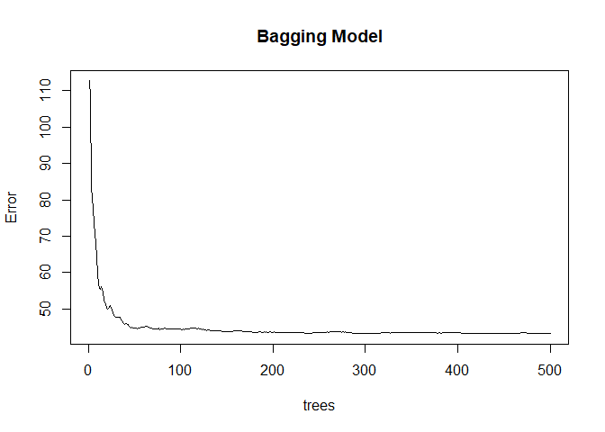
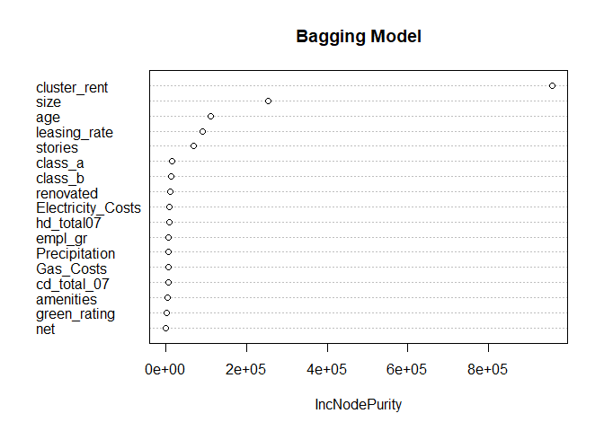
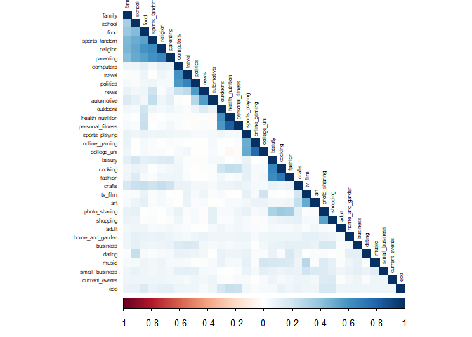
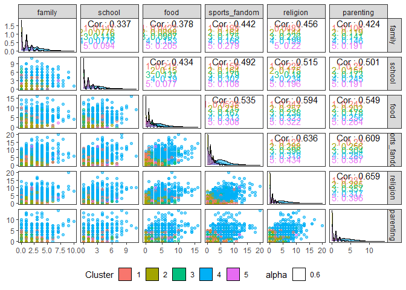
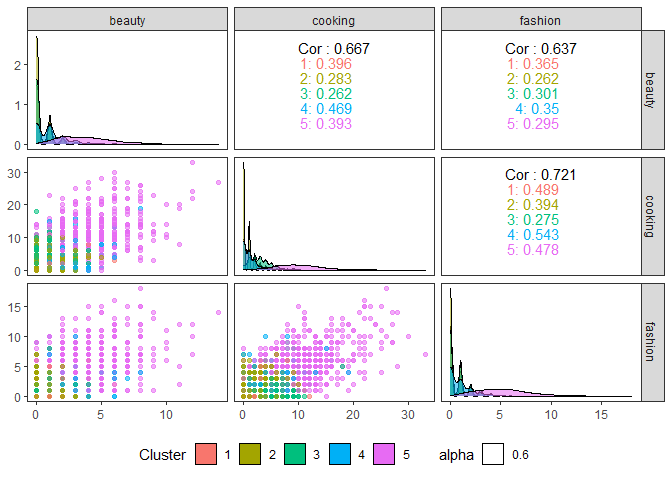
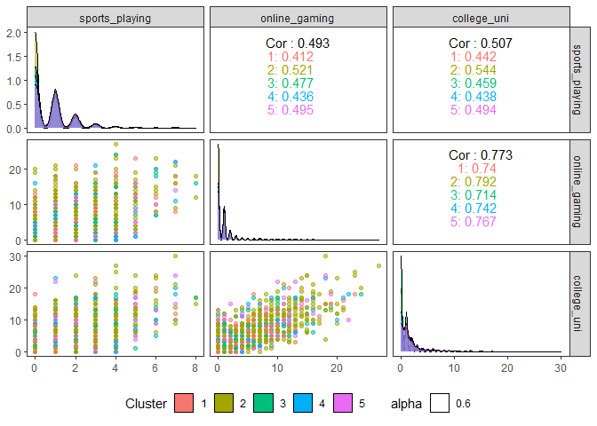
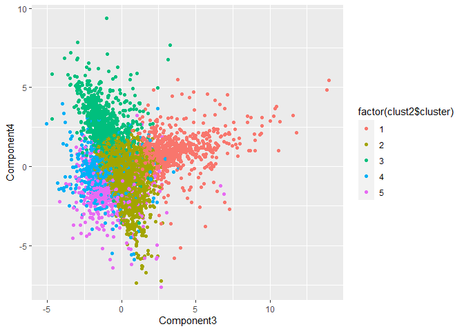

ECO 395M: Exercise 3
====================

Bernardo Arreal Magalhaes - UTEID ba25727

Adhish Luitel - UTEID al49674

Ji Heon Shim - UTEID js93996

Exercise 3.1
------------

In this exercise, we analyzed a dataset on green buildings to build the
best predictive pricing model. We started with cleaning the data. First
we detected all the null values that were missing and deleted them. As
we are running a lasso regression, in order to comply with the limits of
computation, we scaled down 'size' variable from 'square footage' to
'(square footage)/1000'.

Next, we built a base model and used step-wise selection. From the
insights we gathered while cleaning up the data, we decided to delete
the variable 'CS\_PropertyID' as it was just a unique identity number
and contributed nothing to our model. We also deleted another variable
'total\_dd\_07' due to the nature of its collinearity with the variables
'cd\_total\_07' and 'hd\_total07'(total\_dd\_07 = cd\_total\_07 +
hd\_total07). Lastly, we also deleted the variable 'cluster' from our
model because it was recognized as a numerical variable though it was a
categorical one. And in order to reflect the effect of cluster on rent,
we already have cluster.rent variable which shows the average rent by
clusters.

Finally, in order to check if a building is a green building, we used
only 'green\_rating' as our dummy variable and didn't consider 'LEED'
and 'EnergyStar' separately.

To find the best predictive model possible for price, we built 5
different models and compared their performances. At the same time, we
measured elapsed time while we were running each model to see its
computational efficiency.

### Stepwise Selection Model

First, we used stepwise regression method to find the model with the
best performance. We built forward selection model, backward selection
model and stepwise selection model. i) Forward selection model starts
with a model having no variables, and add all possible one-variable
additions to it including every interaction. ii) Backward selection
model starts with the full model that has all the variables including
all of interactions, then improves its performance by deleting each
variable. iii) Stepwise selection model starts with our base model
'lm(Rent~(.-CS\_PropertyID-LEED-Energystar-total\_dd\_07-cluster)' and
we considered all possible one-variable addtions or deletions including
interactions.

The table below shows the performance measured by AIC, elapsed time and
the number of variables of each model. As we can see, the backward
selection model gives us the minimum AIC of 34372.28 with 84 variables,
but it took very long time to compute all these procedures. In terms of
AIC, we concluded that the backward selection model showed the best
performance among three and ran an additional stepwise selection based
on it to check if we could get any improvements. Since we didn't witness
a further minimized AIC, we concluded that the backward selection model
is out best model when we used stepwise selection.

Here's our best predictive stepwise selection model with 84 variables
obtained by backward selection.

    ## 
    ## ===========================================================
    ##                                     Dependent variable:    
    ##                                 ---------------------------
    ##                                            Rent            
    ## -----------------------------------------------------------
    ## size                                  -0.003 (0.007)       
    ## empl_gr                              -1.409** (0.571)      
    ## leasing_rate                         -0.112** (0.051)      
    ## stories                              -0.252** (0.120)      
    ## age                                  0.124*** (0.023)      
    ## renovated                            -8.201*** (2.130)     
    ## class_a                              26.769*** (3.914)     
    ## class_b                              23.912*** (3.657)     
    ## green_rating                           1.276 (0.918)       
    ## net                                   -1.210 (1.804)       
    ## amenities                            -3.703** (1.681)      
    ## cd_total_07                          -0.011*** (0.003)     
    ## hd_total07                           -0.005** (0.002)      
    ## Precipitation                        0.733*** (0.200)      
    ## Gas_Costs                         -2,335.441 (1,459.125)   
    ## Electricity_Costs                   -305.448 (198.790)     
    ## cluster_rent                         0.638*** (0.087)      
    ## size:leasing_rate                   0.0001*** (0.0000)     
    ## size:stories                         -0.0000* (0.0000)     
    ## size:age                            -0.0001*** (0.0000)    
    ## size:renovated                       0.007*** (0.001)      
    ## size:class_a                         -0.021*** (0.005)     
    ## size:class_b                         -0.017*** (0.005)     
    ## size:cd_total_07                    -0.0000*** (0.0000)    
    ## size:hd_total07                      0.0000** (0.0000)     
    ## size:Electricity_Costs               0.496*** (0.152)      
    ## size:cluster_rent                    0.001*** (0.0001)     
    ## empl_gr:age                            0.001 (0.001)       
    ## empl_gr:class_b                      -0.086*** (0.033)     
    ## empl_gr:Gas_Costs                   128.739*** (48.062)    
    ## leasing_rate:cd_total_07             0.0000** (0.0000)     
    ## leasing_rate:hd_total07              0.0000* (0.0000)      
    ## leasing_rate:Precipitation           0.002*** (0.001)      
    ## leasing_rate:Gas_Costs              -10.734*** (4.138)     
    ## leasing_rate:Electricity_Costs        2.846** (1.280)      
    ## leasing_rate:cluster_rent             0.002** (0.001)      
    ## stories:age                          0.004*** (0.001)      
    ## stories:renovated                    -0.215*** (0.036)     
    ## stories:class_a                      0.411*** (0.090)      
    ## stories:class_b                      0.380*** (0.082)      
    ## stories:amenities                    0.092*** (0.026)      
    ## stories:cd_total_07                 0.0001*** (0.0000)     
    ## stories:Precipitation                -0.003** (0.001)      
    ## stories:Electricity_Costs            -5.517** (2.689)      
    ## stories:cluster_rent                 -0.005** (0.002)      
    ## age:class_a                          -0.039** (0.017)      
    ## age:class_b                          -0.049*** (0.012)     
    ## age:green_rating                      0.040* (0.023)       
    ## age:cd_total_07                     -0.0000*** (0.0000)    
    ## age:hd_total07                      -0.0000*** (0.0000)    
    ## age:cluster_rent                    -0.003*** (0.0005)     
    ## renovated:cd_total_07                0.001*** (0.0003)     
    ## renovated:hd_total07                 0.001*** (0.0002)     
    ## renovated:Precipitation              0.086*** (0.033)      
    ## renovated:Gas_Costs                -434.347** (178.191)    
    ## renovated:Electricity_Costs         183.731*** (55.852)    
    ## renovated:cluster_rent                0.067** (0.031)      
    ## class_a:amenities                     -1.017* (0.571)      
    ## class_a:cd_total_07                  -0.002*** (0.001)     
    ## class_a:hd_total07                  -0.002*** (0.0004)     
    ## class_a:Precipitation                -0.281*** (0.054)     
    ## class_a:Gas_Costs                 1,412.093*** (299.902)   
    ## class_a:Electricity_Costs          -645.902*** (80.989)    
    ## class_b:cd_total_07                 -0.001*** (0.0005)     
    ## class_b:hd_total07                  -0.001*** (0.0003)     
    ## class_b:Precipitation                -0.267*** (0.049)     
    ## class_b:Gas_Costs                  990.606*** (298.506)    
    ## class_b:Electricity_Costs          -539.698*** (72.489)    
    ## green_rating:amenities               -2.097** (0.837)      
    ## net:cd_total_07                       0.001* (0.0004)      
    ## net:cluster_rent                      -0.084 (0.055)       
    ## amenities:Precipitation              -0.074** (0.033)      
    ## amenities:Gas_Costs                 376.176** (172.712)    
    ## amenities:Electricity_Costs         109.023*** (40.951)    
    ## amenities:cluster_rent               -0.064** (0.029)      
    ## cd_total_07:Gas_Costs                 0.531** (0.225)      
    ## cd_total_07:Electricity_Costs        0.152*** (0.031)      
    ## hd_total07:Precipitation            -0.0000*** (0.0000)    
    ## hd_total07:Gas_Costs                  0.374** (0.170)      
    ## hd_total07:Electricity_Costs         0.115*** (0.025)      
    ## Precipitation:Gas_Costs              -23.045 (15.536)      
    ## Precipitation:Electricity_Costs       -5.407 (3.406)       
    ## Electricity_Costs:cluster_rent       7.812*** (2.045)      
    ## Constant                              22.997 (17.403)      
    ## -----------------------------------------------------------
    ## Observations                               7,820           
    ## Adjusted R2                                0.648           
    ## ===========================================================
    ## Note:                           *p<0.1; **p<0.05; ***p<0.01

Finally, we did K-fold cross validation to check RMSE when K is 10. We
built a train-test split and repeated the step from 1 to K repetitions
by running a loop. When we calculate RMSE for the backward selection
model, it turned out to be 9.07.

    #RMSE
    sqrt(mean(err_save))

    ## [1] 9.071444

### Lasso Regression Model

After this, we fit a lasso regression model to attempt to assemble the
best predictive model. We used our full model including all the
variables and interactions except some variable that we mentioned above
- CS\_PropertyID, LEED, Energystar, total\_dd\_07, cluster. Running the
lasso regression model, the path plot is shown on the diagram below.

When we measure AICcs of all the segments, the 100th segment has the
lowest AIC value of 34644.64.

    min(AICc(grblasso))

    ## [1] 34644.64

    which.min(AICc(grblasso))

    ## seg100 
    ##    100

Our optimal value of lambda turns out to be -2.17 in log scale, and at
the optimal lambda, our lasso regression model has 25 variables with an
intercept.The result below shows the coefficients of grb\_beta, the
minimum lambda in log scale, and the total number of variables including
an intercept.

<table class="table table-striped" style="margin-left: auto; margin-right: auto;">
<thead>
<tr>
<th style="text-align:left;">
Variable
</th>
<th style="text-align:right;">
Coefficient
</th>
</tr>
</thead>
<tbody>
<tr>
<td style="text-align:left;">
intercept
</td>
<td style="text-align:right;">
2.5779998
</td>
</tr>
<tr>
<td style="text-align:left;">
cluster\_rent
</td>
<td style="text-align:right;">
0.7225084
</td>
</tr>
<tr>
<td style="text-align:left;">
size:stories
</td>
<td style="text-align:right;">
-0.0000208
</td>
</tr>
<tr>
<td style="text-align:left;">
size:age
</td>
<td style="text-align:right;">
-0.0000159
</td>
</tr>
<tr>
<td style="text-align:left;">
size:cd\_total\_07
</td>
<td style="text-align:right;">
-0.0000015
</td>
</tr>
<tr>
<td style="text-align:left;">
size:hd\_total07
</td>
<td style="text-align:right;">
-0.0000001
</td>
</tr>
<tr>
<td style="text-align:left;">
size:Precipitation
</td>
<td style="text-align:right;">
-0.0000308
</td>
</tr>
<tr>
<td style="text-align:left;">
size:cluster\_rent
</td>
<td style="text-align:right;">
0.0004312
</td>
</tr>
<tr>
<td style="text-align:left;">
empl\_gr:class\_a
</td>
<td style="text-align:right;">
0.0522454
</td>
</tr>
<tr>
<td style="text-align:left;">
leasing\_rate:age
</td>
<td style="text-align:right;">
-0.0000584
</td>
</tr>
<tr>
<td style="text-align:left;">
leasing\_rate:cluster\_rent
</td>
<td style="text-align:right;">
0.0006948
</td>
</tr>
<tr>
<td style="text-align:left;">
stories:renovated
</td>
<td style="text-align:right;">
-0.0080782
</td>
</tr>
<tr>
<td style="text-align:left;">
stories:class\_b
</td>
<td style="text-align:right;">
0.0155039
</td>
</tr>
<tr>
<td style="text-align:left;">
stories:Precipitation
</td>
<td style="text-align:right;">
-0.0002636
</td>
</tr>
<tr>
<td style="text-align:left;">
stories:Gas\_Costs
</td>
<td style="text-align:right;">
-0.1875013
</td>
</tr>
<tr>
<td style="text-align:left;">
age:green\_rating
</td>
<td style="text-align:right;">
0.0101577
</td>
</tr>
<tr>
<td style="text-align:left;">
age:cd\_total\_07
</td>
<td style="text-align:right;">
-0.0000050
</td>
</tr>
<tr>
<td style="text-align:left;">
age:Gas\_Costs
</td>
<td style="text-align:right;">
-0.4513846
</td>
</tr>
<tr>
<td style="text-align:left;">
class\_a:cluster\_rent
</td>
<td style="text-align:right;">
0.0411992
</td>
</tr>
<tr>
<td style="text-align:left;">
class\_b:green\_rating
</td>
<td style="text-align:right;">
0.1790789
</td>
</tr>
<tr>
<td style="text-align:left;">
class\_b:amenities
</td>
<td style="text-align:right;">
0.1839059
</td>
</tr>
<tr>
<td style="text-align:left;">
green\_rating:cluster\_rent
</td>
<td style="text-align:right;">
0.0079064
</td>
</tr>
<tr>
<td style="text-align:left;">
net:cluster\_rent
</td>
<td style="text-align:right;">
-0.0546024
</td>
</tr>
<tr>
<td style="text-align:left;">
amenities:Electricity\_Costs
</td>
<td style="text-align:right;">
15.6825595
</td>
</tr>
<tr>
<td style="text-align:left;">
hd\_total07:Electricity\_Costs
</td>
<td style="text-align:right;">
0.0053166
</td>
</tr>
<tr>
<td style="text-align:left;">
Electricity\_Costs:cluster\_rent
</td>
<td style="text-align:right;">
2.4733648
</td>
</tr>
</tbody>
</table>
    ##    seg100 
    ## -2.165552

    ## [1] 26

Then we did K-fold cross validation on our lasso regression model as
well. We found that the root mean squared error for our lasso model is
9.17, which was a lot higher than for our stepwise selection model, so
we can say that the stepwise selection model shows better performance
than the lasso regression model. However, the lasso model takes almost 0
seconds to compute all the procedures to derive its best model whereas
the stepwise method takes more than 10 minutes to do the same thing.
Therefore, we can say the lasso model is computationally more efficient
than the stepwise selection model.

    #RMSE
    sqrt(mean(err_save2))

    ## [1] 9.167089

### Tree - Bagging Model

To further polish our best prediction model, we tried treebagging our
best model with K-fold validation to assess its performance. We used our
base
model('Rent~(.-CS\_PropertyID-LEED-Energystar-total\_dd\_07-cluster')
for our tree bagging, and excluded all the interaction variables because
we didn't need them explicity in tree regressions. The minimum size of
terminal nodes is 5 which is default setting. We set the number of trees
to be 300 times and run the regression. It took more than 7 minutes to
compute the whole procedure, however, the RMSE for our bagging model was
6.47 which was much lower than those of our previous models.

    #RMSE
    sqrt(mean(err_save3))

    ## [1] 6.468217

Below, we constructed a plot that shows the error in the variables.
Judging by the relation between the error and the number of trees, 300
trees which we used in our model is large enough to reduce our errors.

In addition, the graph below shows a variable importance plot. The
bigger the number is ,the greater the reduction on RMSE we get. We can
see that "cluster\_rent" variable has the most important impact on
decideing the rent price in our tree bagging model.

### Tree - Random Forest Model

Now, we fit a random forest model to predict rent price using our base
model and also did K-fold cross validation. First, we start with 300
trees and it took almost 3 minutes to compute all the procedures,
however, the plot below shows that the error curve stops decreasing much
after 50 trees. So we can reduce our number of trees to 100 and save our
computational time.

Now we fit a random forest model with 100 trees and do K-fold cross
validation again. The result indicates that the value of RMSE is 6.26
which is the smallest of all the RMSEs of the models we've seen above.
And the computational efficiency has been improved by taking less than 1
minute to compute all these procedures.

    ## 
    ## Call:
    ##  randomForest(formula = Rent ~ (. - CS_PropertyID - LEED - Energystar -      total_dd_07 - cluster), data = grb[train_set4, ], ntree = 100) 
    ##                Type of random forest: regression
    ##                      Number of trees: 100
    ## No. of variables tried at each split: 5
    ## 
    ##           Mean of squared residuals: 40.5741
    ##                     % Var explained: 82.51

    #RMSE
    sqrt(mean(err_save4))

    ## [1] 6.264436

The plot below is the variable importance plot. We can see that
'cluster\_rent' is the most important variable influencing rent price,
which is the same result as we saw in the bagging model. But it reveals
a slight difference in that the third influential variable is
'Electricity costs', which is 'age' in bagging.

### Tree - Boosting

Finally, we fit a boosting model to derive the best predictive model. As
we've done before, we use our base model to begin with. The result of
our K-fold cross validation shows that the RMSE is 8.28 which is
slightly higher than that of our random forest model. However, it took
only 15 seconds to compute all these procedures.

    #RMSE
    sqrt(mean(err_save5))

    ## [1] 8.280551

Here is the summary of our boosting model which shows the relative
influences of all variables. It appears to be 'cluster\_rent', 'size',
'leasing\_rate' are three most influential variables on our dependent
variable. This result is similar with previous results that we've seen
above, but the third influential variable is slightly different, too.

    summary(model5_train)

    ##                                 var      rel.inf
    ## cluster_rent           cluster_rent 65.511446995
    ## size                           size 16.973059316
    ## leasing_rate           leasing_rate  5.775356073
    ## age                             age  4.355874040
    ## stories                     stories  2.809054568
    ## Electricity_Costs Electricity_Costs  1.114105430
    ## class_a                     class_a  0.977814012
    ## Precipitation         Precipitation  0.879403764
    ## cd_total_07             cd_total_07  0.548325607
    ## hd_total07               hd_total07  0.322796411
    ## empl_gr                     empl_gr  0.217072885
    ## class_b                     class_b  0.198870952
    ## amenities                 amenities  0.162363744
    ## Gas_Costs                 Gas_Costs  0.066805687
    ## renovated                 renovated  0.059431465
    ## green_rating           green_rating  0.023280193
    ## net                             net  0.004938858

### Which model shows the best performance?

By using K-fold cross validation, we derived 5 RMSE out of 5 models as
below. We can see that the randomforest model shows the lowest RMSE
which means the best performance.

The randomforest model is superior in terms of computational speed. It
took less than 1 minute to compute all the procedures, which is very
efficient compared to the stepwise selection and the bagging. The lasso
regression and the boosting method didn't take much computational time,
but their performances are worse than the random forest model.Therefore,
we can conclude that the random forest model shows the best performance.

<table class="table table-striped" style="margin-left: auto; margin-right: auto;">
<tbody>
<tr>
<td style="text-align:left;">
Model
</td>
<td style="text-align:left;">
Stepwise
</td>
<td style="text-align:left;">
Lasso
</td>
<td style="text-align:left;">
Bagging
</td>
<td style="text-align:left;">
Randomforest
</td>
<td style="text-align:left;">
Boosting
</td>
</tr>
<tr>
<td style="text-align:left;">
RMSE
</td>
<td style="text-align:left;">
9.07
</td>
<td style="text-align:left;">
9.17
</td>
<td style="text-align:left;">
6.47
</td>
<td style="text-align:left;">
6.26
</td>
<td style="text-align:left;">
8.28
</td>
</tr>
</tbody>
</table>
### The Partial Effect of Green Certification on Rent

In order to derive the average change in rental income per square foot
associated with green certification, holding other features of the
building constant, we used 'partial' function in 'pdp package'.

The average rent value without green certification holding other
features constant is 28.50924, and the average rent value with green
certification holding other features is 29.07784. Therefore, the
difference 0.5686 is the average change in rental income per square foot
associated with green certification, holding other feature of the
building fixed.

    partial(model4_train, pred.var = 'green_rating', n.trees=100)

    ##   green_rating     yhat
    ## 1            0 28.43287
    ## 2            1 28.89411

    29.07784-28.50924

    ## [1] 0.5686

Exercise 3.2
------------

### Why can’t I just get data from a few different cities and run the regression of "Crime" on "Police" to understand how more cops in the streets affect crime?

A researcher can easily think about a model that treats "Police"
variables as regressors when explaining changes in crime, and another
model, with a different research agenda, that includes "Crime" variables
as regressors when explaining changes in police force. This fact
suggests that crime and police might be jointly determined, what creates
an endogeneity problem and brings difficulties when trying to
disentangle the causal mechanism from the correlation between police
force and crime, possibly misleading to wrong conclusions.

Therefore, if we collect data from different cities and run a regression
of "Crime" on "Police", the coefficient associated with the police force
might be biased. If more police officers are hired in response to an
increase in crime, a positive correlation can emerge even if this
increase in police force end up reducing crime after all. Also, cities
that have a high level of criminality are likely to have large police
forces, while cities that have a low level of criminality are likely to
have a small police force. Detroit, for instance, has twice as many
police officers per capita as Omaha, and a violent crime rate over four
times as high, but it would be a mistake to attribute the differences in
crime rates to the presence of the police. (Levitt, 1995)

### How were the researchers from UPenn able to isolate this effect?

In order to isolate the causal effect, the researchers explored how an
exogenous change in police force affected crimes in the District of
Columbia. They argue that, in the presence of a high terrorism alert,
there is an increase in police force that is not caused by local crimes.
So, given the fact that (i) terrorism risk is correlated with police
force (instrument relevance: *C**o**v*(*z*, *x*)≠0) and (ii) terrorism
risk only affects local crime indirectly thru the police force
(instrument exogeneity: *C**o**v*(*z*, *u*)=0), the researchers could
exploit the variation in terrorism alert as an exogenous factor that
affects crime.

Column 1 shows that the presence of a high alert is associated with a
decrease of 7.3 crimes per day, holding all else fixed. Column 2 shows
that, when controlling by the presence of tourists (using log of Metro
ridership at midday), the presence of a high alert is associated with a
decrease of 6.2 crimes per day, holding all else fixed. Both
coefficients are statistically significant at the 5% level.

### Why did they have to control for Metro ridership? What was that trying to capture?

The researchers controlled for Metro ridership because there is a
reasonable possibility that a decrease in crime as a response to the
presence of a high terrorism alert might be happening indirectly thru
alternative factors, such as a reduction in tourism. In that sense,
midday Metro ridership is a good proxy for tourism, and this hypothesis
implies that having fewer potential victims on the streets would lead to
fewer committed crimes.

When controlling for midday Metro ridership, the magnitude of the
coefficient associated with a high alert slightly decrease, but remained
in the confidence interval (−7.316 ± 2.877 × 1.96). Column 2 shows that
a 10% increase in Metro ridership is associated with an increase of 1.7
crimes per day, holding all else fixed.

This procedure is important because, when trying to measure the causal
effect of an intervention, we are implicitly assuming that all the other
variables that affect the outcome, observed and unobserved, are not
changing. Comparative statics methodological concept describes the
effect of an explanatory variable on the response variable when holding
all else fixed. (Cunningham, 2020) So, if something else is changing, we
need to control for that change.

### Below I am showing you "Table 4" from the researchers' paper. Just focus on the first column of the table. Can you describe the model being estimated here? What is the conclusion?

The researchers also analyzed the geographical patterns of crime in
Washington, D.C. Given the fact that most of the potential targets of
terrorist attacks, such as the White House and the Congress, are located
in the National Mall area, one could argue that, in the presence of a
terror alert, the police department would divert resources from other
districts and concentrate them in District 1. If this hypothesis was
right, we would expect a decrease in crime in District 1, but an
increase in crime in the other districts. So, the researchers included
an interaction
*H**i**g**h**A**l**e**r**t* × *D**i**s**t**r**i**c**t*1 to
allow for district fixed effects.

Column 1 shows that, holding all else fixed, crime in District 1
decreases by 2.62 crimes per day, while in the other districts the
effect is not statistically significant (but also not positive). This
result provide evidence that an important part of the decrease in crime
associated with the presence of a high terror alert is driven by the
decrease in crime in the National Mall area, where the increment of
police force tends to be placed.

Exercise 3.3
------------

In this question we analyzed a data set on 6,500 different bottles of
vinho verde wine from northern Portugal. We had information on 11
chemical properties of these wines, whether they were red or white and
the quality of the wine, as judged on a 1-10 scale. Our goal was to
assess what dimension reduction clustering technique (k-means or PCA)
would be more accurate. We were also tasked to determine if chemical
properties could be used as indicators to determine the quality of
wines.

### Data cleaning

We started out by cleaning the data first. We centered, scaled and
normalized the data to mitigate the impacts of extreme data points.

Then we plotted the below shown correlation plot of all 11 chemical
properties to determine how strongly they are correlated with one
another. Just by eyeballing the below plot, we could tell that perhaps
the chemical properties “total sulfur dioxide”, “free sulfur dioxide”
and “residual sugar” would be the most relevant chemical properties for
us.  Then we
started clustering our normalized dataset with k-means 2 as we had 2
types of wines by color, red or white and with 25 starts. We then
attempted to find the scaled center of one of the clusters in order to
find the most prominent variables, judging by their coefficient. When we
did this for cluster 1, we found out that the chemical properties “total
sulfur dioxide”, “free sulfur dioxide” and “residual sugar” appeared to
have the highest coefficients. This implied the other cluster (cluster
2) would have the lowest coefficient values for these variables, so
these were the variables could explain the difference between the two
different wine color clusters very clearly. This further cemented our
reasoning for picking these variables.

From the below scatter plots and bell curves of these three chemical
properties we could see that they formed somewhat proper clusters,
however there were plenty of overlaps. We also needed to determine that
our two clusters had distinguished wine types, red and white.
 After this we
attempted to form the clusters as per the colors of the wines. So the
cluster that mostly had red wines was be the red wine cluster and
similarly the cluster that mostly had white wines was be the white wine
cluster.

    ##               wine$color
    ## wine$color_hat  red white
    ##          red   1575    68
    ##          white   24  4830

From the above table we could see that we had clustered our wines pretty
accurately, with a majority of our red wines being under the
‘color\_hat’ cluster red and white wines being under the ‘color\_hat’
cluster white. With a 98.58% accuracy, we concluded that our k-means
clustering had done a pretty good job in terms of dimension reduction.

    ##                   wine$color
    ## wine$color_hat_kpp  red white
    ##              red   1575    68
    ##              white   24  4830

Next, we did a k -means++ clustering with k-means 2 and 25 starts,
again. Just like before, we labelled our clusters as ‘color\_hat’
cluster red and white wines being under the ‘color\_hat’ cluster white.
As shown above, with a 98.58% accuracy, we found out that our k-means++
clustering performed just as efficiently as k-means.

    ## Importance of components:
    ##                           PC1    PC2    PC3     PC4     PC5     PC6     PC7
    ## Standard deviation     1.7407 1.5792 1.2475 0.98517 0.84845 0.77930 0.72330
    ## Proportion of Variance 0.2754 0.2267 0.1415 0.08823 0.06544 0.05521 0.04756
    ## Cumulative Proportion  0.2754 0.5021 0.6436 0.73187 0.79732 0.85253 0.90009
    ##                            PC8     PC9   PC10    PC11
    ## Standard deviation     0.70817 0.58054 0.4772 0.18119
    ## Proportion of Variance 0.04559 0.03064 0.0207 0.00298
    ## Cumulative Proportion  0.94568 0.97632 0.9970 1.00000

Next, we performed a Principal Component Analysis(PCA). The above table
showed that the first three principal components (PC1-PC3) combined form
64.3% of the total variance in the dataset, which is a highly
significant proportion. Based on this, we used our first three principal
components to perform our clustering.

    ##                    wine$color
    ## cluster_pca$cluster  red white
    ##                   1   24  4816
    ##                   2 1575    82

From the above scatter plot and confusion matrix we could see that our
PCA based clustering also did a very good job in terms of dimension
reduction with an accuracy rate of 98.3%. Hence, we concluded that in
terms of this case, k-means, k-means++ and PCA all seem to be excellent
dimension reduction techniques, however k-means and k-means++
outperformed PCA by a mere 0.2%p.

### Distinguishing quality

After this we were tasked with answering another key problem: whether
this technique also seem capable of sorting the higher from the lower
quality wines or not. Due to this we had to distinguish the quality of
wine, since all the wines were judged from a scale of 1-10, we had 10
categories. However, inspecting the data set, we found out that a
majority of wines were rated 5 or 6 and there were no wines that were
scored 1, 2 or 10, that is extremely high or low. Thus, in reality, we
only had 7 different qualities of wine.

Due to the fact that our dataset isn't balanced regarding wine quality,
there is a real possibility that wines with quality 5 and 6 will be the
the most frequent values in more than one cluster, which would bring
additional difficulties on determining which cluster corresponds to
which quality of wine.

Bearing this in mind, we applied the same tools as we did initially,
starting by running Kmeans with K=7.

    ##                 wine$quality
    ## cluster2$cluster   3   4   5   6   7   8   9
    ##                1   4  53 320 553 181  36   0
    ##                2   3  14  67 440 438  94   4
    ##                3   7  63 466 344  41   2   0
    ##                4   1   2  20   9   1   0   0
    ##                5   4  45 422 587 157  25   0
    ##                6   4  15 202 266 139  14   0
    ##                7   7  24 641 637 122  22   1

Above, we see the confusion matrix of our k-means clustering which
barely provided any insight. For instance, we observe that both wines of
quality 3 and quality 6 maximum observations (7 and 645) are grouped in
cluster 4. On the other hand, cluster 4 most frequent observations are
from wines with quality 5. Therefore, determining how to classify this
cluster would require some degree of arbitrariness.

    ##                     wine$quality
    ## cluster_kpp2$cluster   3   4   5   6   7   8   9
    ##                    1   1   2  20   9   1   0   0
    ##                    2   7  24 655 640 122  22   0
    ##                    3   5  64 446 549 137  27   1
    ##                    4   4  15 200 265 141  14   0
    ##                    5   4  21  77 548 446  97   4
    ##                    6   7  63 471 350  43   2   0
    ##                    7   2  27 269 475 189  31   0

Similarly, we conducted k-means++ clustering. Just as the case with
k-means clustering, the confusion matrix in this case didn't provide
much insights either.

Similarly, we also did a PCA based clustering and noticed that bar few
extremes, all the data points are clustered collectively around the
center, as we could see in the scatterplot that illustrated all 7
clusters. Based on this we decided to see the absolute quantities of
wines that were given their respective scores.

As seen in the tables from kmeans and kmeans++, we could see how the
quality scores of the wines are distributed and where our problem lied.
A majority of wines were rated between 5, 6 and 7. That meant, all 7
clusters ended up being dominated by wines being rated between 5-7. As a
result, wines rated 2, 3 or 9 were heavily under-represented whereas
wines rated between 5-7 were heavily over-represented among all 7
clusters. Due to this it was determined to distinguish what chemical
property played a role in good or poor quality of wines. Earlier, when
we were only distinguishing between red and white wines using k-means 2,
we had some overlaps, but this wasn’t much of an issue and our results
were still pretty accurate as we had only two categories. But as the
number of categories and clusters grew, the disparity between categories
was more prevalent and we couldn’t succeed in sorting the higher from
the lower quality wines.

Exercise 3.4
------------

In this exercise, we explored the content of multiple tweets from a
sample of followers of NutrientH20's Twitter profile, and come up with
some interesting insights about the audience by identifying possible
market segments.

### Data cleaning

We started by cleaning our data set, which is originally comprised of
7,882 observations and 36 variables.

First, we deleted all the users whose tweet fell into 'spam' category at
least once, due to the high probability of this account being a bot.
Naturally, we excluded the 'spam' variable from our data set.

Additionally, we also deleted the variables 'chatter' and
'uncategorized', since these categories would hardly give some useful
insights about the followers.

Finally, even though tweets classified in the 'adult' category can be
interpreted as spam, sometimes it can also be a hobby for real followers
too. In that sense, considering that normal people don't tweet much porn
in public, we deleted users that have more than 20% of their total posts
in pornography, regarding them as bots.  
So we end up with 7,676 observations with 33 variables in our data set.

### K-means++ clustering

We'll start with performing clustering analysis. Since our data doesn't
show any kinds of hierarchy, we'll focus on K-means analysis. We'll use
K-means++ rather than K-means because it's already known that K-means++
shows a better performance.  
The first question we encounter when doing K-means++ is "How many
clusters should we set?", i.e, "What is our optimal K?".  
In order to find its answer, we used three methods - Elbow plot, CH
index, and Gap statistics.

We scaled our data first, and performed three analyses by using scaled
data.  
The first graph shows the elbow plot of our data set. As we can see,
there's no distinguished elbow here, so it doesn't give us clear
messages about the optimal K.  
The second one is the CH index. We can see it is the highest when K=1,
and it decreases gradually. So we cannot get a satisfactory answer for
our question, either.

Finally, we can see our gap statistics diagram of our data below.
However, We cannot find any dips here. Unfortunately, it seems that none
of these means could lead us to a conclusive answer for the optimal K.

Since it is difficult to find the optimal K only by eyeballing the
graph, we decided to plot a correlogram, and try to identify possible
singularities among the variables.

From the correlation plot, we can observe some subgroups of variables
that are highly correlated with each other. The variables 'family',
'school', 'food', 'sports\_fandom', 'religion' form the first group.
'Computers', 'travel', 'politics', 'news' and 'automotive' form the
second. 'Outdoors', 'health\_nutrition' and 'personal\_fitness' the
third. 'Sports\_playing', 'online\_gaming' and 'college\_uni' form the
fourth. And 'beauty', 'cooking' and 'fashion' form the fifth.

Therefore, we decided to use K=5.

For the first subgroup, we can see that followers that belong to
"Cluster 4" are those that, in general, have a high interest in
'family', 'school', 'food', 'sports\_fandom' and 'religion'.

For the second subgroup, we can see that followers that belong to
"Cluster 1" are those that, in general, have a high interest in
'Computers', 'travel', 'politics', 'news' and 'automotive'.

For the third subgroup, we can see that followers that belong to
"Cluster 3" are those that, in general, have a high interest in
‘Outdoors’, ‘health\_nutrition’ and ‘personal\_fitness’.

For the fourth subgroup, we can see that followers that belong to
"Cluster 5" are those that, in general, have a high interest in
‘Sports\_playing’, ‘online\_gaming’ and ‘college\_uni’.

For the fifth subgroup, we can't find some well defined patterns when
comparing within cluster interests in ‘beauty’, ‘cooking’ and ‘fashion’.

### Can we use PCA in this example?

Now, we try to perform a principal component analysis to find
low-dimensional summaries of our data set. Then we'll divide our samples
into several clusters hoping that we can make our model simpler and more
interpretable.  
However, the table below shows that it's hard to narrow down the number
of variables by using PCA. We need at least 7 principal components to
explain more than 50% of the variance of the data, 13 components for
70%, and 23 components for 90%.  
So performing clustering analysis after PCA doesn't seem to be a good
idea. However, PCA itself can give us some useful information about our
samples in another sense.

    ## Importance of components:
    ##                          PC1     PC2     PC3     PC4     PC5     PC6     PC7
    ## Standard deviation     2.103 1.66757 1.59296 1.53277 1.47076 1.28888 1.21820
    ## Proportion of Variance 0.134 0.08427 0.07689 0.07119 0.06555 0.05034 0.04497
    ## Cumulative Proportion  0.134 0.21823 0.29512 0.36632 0.43187 0.48220 0.52718
    ##                           PC8     PC9    PC10    PC11    PC12    PC13    PC14
    ## Standard deviation     1.1745 1.05380 1.00312 0.99122 0.96533 0.95594 0.93419
    ## Proportion of Variance 0.0418 0.03365 0.03049 0.02977 0.02824 0.02769 0.02645
    ## Cumulative Proportion  0.5690 0.60263 0.63312 0.66289 0.69113 0.71882 0.74527
    ##                           PC15    PC16    PC17    PC18    PC19   PC20    PC21
    ## Standard deviation     0.92014 0.90739 0.84119 0.80616 0.75242 0.6942 0.68362
    ## Proportion of Variance 0.02566 0.02495 0.02144 0.01969 0.01716 0.0146 0.01416
    ## Cumulative Proportion  0.77093 0.79588 0.81732 0.83701 0.85417 0.8688 0.88293
    ##                           PC22   PC23    PC24    PC25    PC26    PC27    PC28
    ## Standard deviation     0.65107 0.6473 0.63571 0.63036 0.61517 0.59681 0.59223
    ## Proportion of Variance 0.01285 0.0127 0.01225 0.01204 0.01147 0.01079 0.01063
    ## Cumulative Proportion  0.89578 0.9085 0.92072 0.93276 0.94423 0.95502 0.96565
    ##                          PC29    PC30    PC31   PC32    PC33
    ## Standard deviation     0.5509 0.48336 0.47759 0.4376 0.42047
    ## Proportion of Variance 0.0092 0.00708 0.00691 0.0058 0.00536
    ## Cumulative Proportion  0.9748 0.98193 0.98884 0.9946 1.00000

The table below is the matrix of variable loadings from PC1 to PC4.
We'll see if what we found by PCA can share something in common with our
findings by our K-means++ clustering. In PC1, we can see 'religion',
'food', and 'parenting' show the largest value, which means the more
tweets a user has made in these categories, the more scores (s)he'll get
in PC1. And there is no negative value here.  
In PC2, 'sports\_fandom', 'religion', 'parenting' have the largest
values, which means the more tweets one has made in these categories,
the more scores one will get in PC2. On the other hand,
'cooking','fashion', and 'photo\_sharing' show the smallest values, and
they are all negative numbers. It means that the more one tweets in
these categories, the less scores one will get. In PC3,
'politics','travel', and 'computers' have the largest values, which
means the more tweets one has made in these categories, the more scores
one will get in PC3. On the other hand, 'helath\_nutrition',
'personal\_fitness', and 'cooking' have the smallest and negative
values, which means the more tweets one has made in these categories,
the less scores one will get in PC3.  
Lastly, in PC4, 'health\_nutrition','personal\_fitness','outdoors' have
the largest values, which means the more tweets one has made in these
categories, the more scores one will get in PC4. On the other hand,
'college\_uni', 'online\_gaming', and 'sport\_playing' have the smallest
and negatieve values, which means the more tweets one has made in these
categories, the less scores one will get in PC4.

    ##                         PC1         PC2           PC3          PC4
    ## current_events   0.09142399 -0.05410808  4.531458e-02 -0.025387359
    ## travel           0.11816730 -0.04390987  4.432048e-01  0.100971888
    ## photo_sharing    0.15499321 -0.27211473 -2.351845e-02 -0.128689405
    ## tv_film          0.09385089 -0.07726121  9.986912e-02 -0.125293598
    ## sports_fandom    0.30386623  0.30117716 -7.491278e-02 -0.027171272
    ## politics         0.13166516 -0.01234793  5.058171e-01  0.159675429
    ## food             0.31327290  0.20064102 -1.162350e-01  0.085645483
    ## family           0.25541690  0.18567929 -6.935568e-02 -0.053279908
    ## home_and_garden  0.11623665 -0.05584662  2.843525e-02 -0.002316342
    ## music            0.11601455 -0.14984147  1.049087e-05 -0.107999623
    ## news             0.13230534  0.02864084  3.480255e-01  0.151127894
    ## online_gaming    0.07189923 -0.09686466  6.389080e-02 -0.289583077
    ## shopping         0.10727934 -0.15656779  2.216375e-02 -0.057204197
    ## health_nutrition 0.12209566 -0.21693847 -1.799366e-01  0.440267789
    ## college_uni      0.08874946 -0.12176682  9.573968e-02 -0.328644811
    ## sports_playing   0.12602898 -0.12258086  5.622047e-02 -0.233955849
    ## cooking          0.18243707 -0.37143810 -1.588821e-01 -0.052797562
    ## eco              0.14365150 -0.10046335 -2.227886e-02  0.121236147
    ## computers        0.14507507 -0.04150128  3.806543e-01  0.106559637
    ## business         0.12990058 -0.09411873  1.082838e-01 -0.015300854
    ## outdoors         0.14385185 -0.17793501 -9.856819e-02  0.387012463
    ## crafts           0.19420813  0.01545584  1.259731e-04 -0.021292957
    ## automotive       0.13046270  0.04095098  1.852575e-01  0.041524953
    ## art              0.09780072 -0.06801447  6.207581e-02 -0.092428201
    ## religion         0.31489807  0.29319463 -1.140605e-01 -0.038566850
    ## beauty           0.19813313 -0.24742898 -1.339391e-01 -0.171877909
    ## parenting        0.31098229  0.27352119 -1.100105e-01 -0.017964290
    ## dating           0.09794693 -0.06552873  3.706816e-02  0.026755872
    ## school           0.28894201  0.18919562 -1.012837e-01 -0.054407824
    ## personal_fitness 0.13506744 -0.21168976 -1.740060e-01  0.422951177
    ## fashion          0.17609130 -0.31605232 -1.174868e-01 -0.170549289
    ## small_business   0.11661058 -0.09018109  1.041623e-01 -0.097714850
    ## adult            0.06391423 -0.02382340 -1.141215e-02  0.012200555

Now, We plot our samples on two-dimensional space which consist of two
axis - PC1 and PC2, and color them by clusters that we showed in
Kmeans++. Here, we can find different characteristics depending on
clusters. For example, cluster4 clearly shows higher PC2 values than
other clusters do on average. We've already seen that users in cluster4
have a high interest in 'sports\_fandom' and 'religion.' And as we have
shown above, the more tweets one has made in 'sports\_fandom' and
'religion', the more scores one will get in PC2. So it is no wonder that
cluster4 shows high PC2 values on the graph below.

We can find the commonality between clustering and PCA in another
example. The plot below shows the relationship between PC3 and PC4. One
thing we can clearly see here is that cluster1 shows higher PC3 value
than other clusters on average.  
We already mentioned above that the more tweets one has made in
'politics','travel', and 'computers' categories, the more PC3 scores one
will get. And we can recall that users in cluster1 have a high interest
in 'computers', 'travel', and 'politics'. This correspondence fortifies
our finding that clustering and PCA can share something in common.

